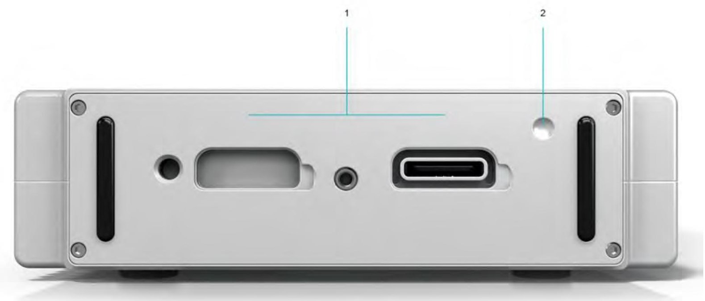
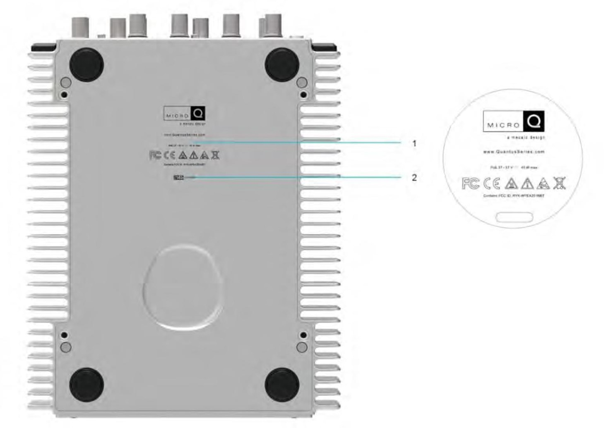

| Габариты (Ш x В x Г)                                          | 172 х 251 х 53 мм |
|---------------------------------------------------------------|-------------------|
| Масса в полностью укомплектованном состоянии с аккумулятором  | 2,70 кг           |
| Масса в полностью укомплектованном состоянии без аккумулятора | 1,85 кг           |
| Условия окружающей среды                                      | \-20 °C … 50 °C   |
| Пыле- влагозащита                                             | IP40              |
| Влажность (без конденсации)                                   | 90%               |
| Ударный импульс (длительностью 11 мс)                         | 40 g              |
| Случайная вибрация (10–2000 Гц)                               | 0,1 g2/Гц         |

### Вид спереди

{width=1587px height=765px}

**1\.      S-Port**

Порт S-Port служит для подключения дополнительных устройств.

<color color="red">*Дополнительные сведения см. в разделе 4.4. Порт S-Port.*</color>

**2\.      Встроенный SSD-накопитель и аккумулятор**

**Встроенный SSD-накопитель**

Безопасное и надежное хранение данных на встроенном твердотельном накопителе 128 ГБ.

**Встроенный аккумулятор**

Литий-ионный аккумулятор

<color color="red">*Дополнительные сведения см. в разделе 3.1.3. Питание от аккумуляторов.*</color>

**3\.      GPS-антенна**

Встроенный GPS-модуль для получения информации о времени и местоположении.

<color color="red">*Дополнительные сведения см. в разделе 4.3. Встроенный GPS-канал.*</color>

**4\.      2 канала CAN и CAN FD**

2 канала CAN и CAN FD для поддержки шины CAN.

<color color="red">*Дополнительные сведения см. в разделе 4.1. Встроенные каналы CAN и CAN FD.*</color>

**5\.      Ethernet (PoE, PTP) Ethernet**

Подключение к ноутбуку, ПК и сети через Ethernet.

<color color="red">*Дополнительные сведения см. в разделе 3.3.2. Подключение через PoE.*</color>

**PoE (питание по сети Ethernet)**

Питание MICRO**Q** и подключение к сети по интерфейсу PoE.

<color color="red">*Дополнительные сведения см. в разделе 3.1.2. Питание ORIONm по PoE и 3.3.2. Подключение через PoE..*</color>

**PTP (протокол точного времени)**

Синхронизация по протоколу IEEE 1588-2008 PTP через Ethernet.

**6\.      Кнопка питания**

Кнопка для включения и выключения питания *ORIONm*.

<color color="red">*Дополнительные сведения см. в разделе 3.2. Включение/выключение ORIONm.*</color>

**7\.      Антенна Wi-Fi**

Подключение к ноутбуку, ПК, сети и смартфону по Wi-Fi. Для повышения эффективности подключения установлено две антенны с обеих сторон MICRO**Q**. <color color="red">*Дополнительные сведения см. в разделе 3.3.1. Подключение по Wi-Fi.*</color>

**8\.      TAC-каналы**

2 канала тахометра

Измерение сигналов от тахометра.

<color color="red">*Дополнительные сведения см. в разделе 4.2. Встроенные каналы тахометра.*</color>

**9\.      Взаимозаменяемые модули преобразования электрических сигналов аналого-цифровые**

**Представлен: 6xACCs - 6-канальный модуль входного сигнала напряжения и ICP**® **(IEPE)**

<color color="red">*Дополнительные сведения см. в разделе 8*</color>

**10\.    Клемма заземления**

Подсоедините клемму заземления к контуру заземления здания, если существует риск поражения электрическим током в среде проведения измерений. Клемму можно использовать в качестве опорного заземления для измерения аналоговых сигналов (необходимо применить подходящие настройки к соответствующим каналам). В некоторых случаях может использоваться для снижения шума аналоговых сигналов.

**11\.    Источник питания пост. тока (разъем LEMO**®**)**

На ORIONm можно подавать питание пост. тока (10–30 В пост. тока).

<color color="red">*Дополнительные сведения см. в разделе 3.1.1. Питание от источника питания постоянного тока.*</color>

### Вид сзади

{width=1579px height=675px}

**1\.      Служебный разъем и разъем для внешнего аккумулятора модификации ORIONm-B**

К этому разъему можно подключить внешний аккумулятор.

*2*.      Паз\*\*

Паз находится в верхнем правом углу задней панели модификации ORIONm-B. Для подключения внешнего аккумулятора совместите паз в верхнем правом углу внешнего аккумулятора с соответствующим пазом на задней панели ORIONm-B. <color color="red">*Дополнительные сведения см. в разделе*</color> <color color="red">[*4\.3.1. Подключение внешнего аккумулятора*](#bookmark38)*.*</color>

### Вид снизу

{width=1464px height=1036px}

**1\.      Паспортная табличка**

Паспортная табличка включает данные о сертификатах и предупреждения об эксплуатации ORIONm.

**2\.**      **Серийный номер**

Серийный номер каждого ORIONm указан на обратной стороне прибора. Этот идентификатор позволяет нашим специалистам получить доступ к информации о конкретном устройстве для предоставления услуг поддержки.