## **Информация о цветовой индикации**

<table header="row">
<tr>
<td>

**Зеленый**

Индикация уровня заряда батареи, состояния системы, состояния приложения и сети

Горит зеленым -- активно

Мигает зеленым -- активно, НЕ ПРЕРЫВАТЬ ОПЕРАЦИЮ

Пример: состояние системы

*Дополнительные сведения см. в разделе 3.5.2. Индикаторы на приборе.*

</td>
<td align="center">

{width=96px height=130px}

</td>
</tr>
<tr>
<td>

**Голубой**

Индикация уровня инициализации, состояния активности сети и состояния батареи

Горит голубым -- доступно, режим ожидания

Мигает голубым -- переход в режим доступности, НЕ ПРЕРЫВАТЬ ОПЕРАЦИЮ

Пример: состояние батареи

*Дополнительные сведения см. в разделе 3.5.2. Индикаторы на приборе.*

</td>
<td align="center">

{width=96px height=117px}

</td>
</tr>
<tr>
<td>

**Оранжевый**

Индикация состояния обновления или уровня заряда батареи

Горит оранжевым -- требуется вмешательство

Мигает оранжевым -- требуется немедленное вмешательство

Пример: уровень заряда батареи

*Дополнительные сведения см. в разделе 3.5.2. Индикаторы на приборе.*

</td>
<td align="center">

{width=96px height=123px}

</td>
</tr>
<tr>
<td>

**Красный**

Индикация системной ошибки

Горит красным -- ошибка

Все красные индикаторы указывают на ошибки.

*Дополнительные сведения об индикаторах инициализации прибора см. в разделе 3.5.2. Индикаторы на приборе.*

</td>
<td align="center">

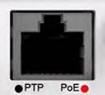{width=105px height=95px}

</td>
</tr>
<tr>
<td>

**Фиолетовый**

Индикация выполнения обновления.

Пример: обновление прошивки контроллера

*Дополнительные сведения см.3.5.2. Индикаторы на приборе.*

</td>
<td align="center">

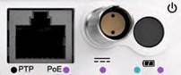{width=202px height=84px}

</td>
</tr>
</table>

## **Индикаторы на приборе**

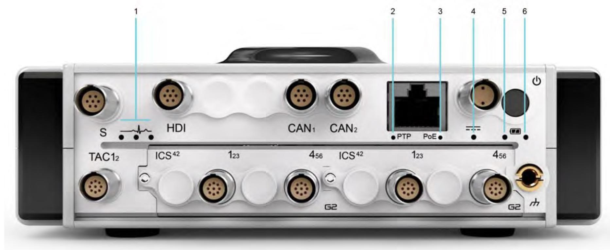{width=1865px height=766px}

### **Индикаторы состояния системы (пункт 1) Инициализация системы**

<table header="row">
<colgroup><col width="364"/><col width="372"/></colgroup>
<tr>
<td>

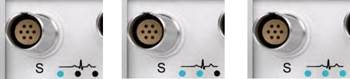{width=350px height=79px}

</td>
<td>

Эти три голубых индикатора указывают на ход инициализации системы (1–3). Каждый индикатор сначала мигает, а затем загорается голубым. Когда загорятся все три индикатора, это будет указывать на завершение инициализации.

</td>
</tr>
</table>

### **Состояние системы и приложения (активное)**

<table header="row">
<tr>
<td>

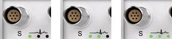{width=347px height=80px}

</td>
<td>

Как правило, порядок индикации следующий:

•           Один индикатор горит зеленым -- система активна и приложение запускается.

•           Два индикатора горят зеленым -- приложение активно и работает.

•           Три индикатора, горящих зеленым, указывают на определенные операции приложения (в зависимости от конкретной конфигурации ORIONm и ПО, используемого для измерений).

</td>
</tr>
</table>

### Индикатор состояния сетевой активности/протокола PTP (пункт 2)

**Сетевая активность**

<table header="row">
<tr>
<td>

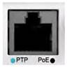{width=96px height=96px}

</td>
<td>

Горит голубым -- подключен Ethernet-кабель. Мигает голубым -- выполняются действия в сети.

</td>
</tr>
</table>

### Индикатор обновления/PoE (пункт 3)

**Питание по кабелю Ethernet (PoE) доступно**

<table header="row">
<tr>
<td>

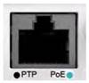{width=100px height=93px}

</td>
<td>

Голубой индикатор -- PoE-интерфейс подключен и доступен для использования.

</td>
</tr>
</table>

### **Питание по кабелю Ethernet (PoE) активно**

<table header="row">
<tr>
<td>

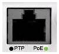{width=100px height=92px}

</td>
<td>

Зеленый индикатор -- PoE-интерфейс подключен и активен.

</td>
</tr>
</table>

### Индикаторы питания пост. тока LEMO® (пункт 4)

**Источник питания пост. тока активен**

<table header="row">
<tr>
<td>

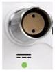{width=80px height=105px}

</td>
<td>

Зеленый индикатор -- на ORIONm подается питание от источника пост. тока.

</td>
</tr>
</table>

**Ошибка источника питания пост. тока**

<table header="row">
<tr>
<td>

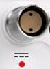{width=73px height=99px}

</td>
<td>

Красный индикатор указывает на проблему с источником питания пост. тока. Это может быть перенапряжение или неправильная полярность подключенного источника питания.

</td>
</tr>
</table>

#### **Примечание:**

Индикатор источника питания пост. тока горит, только если ORIONm работает от такого источника. Если ORIONm работает от другого источника питания, этот индикатор не горит.

### Индикаторы состояния батареи (пункт 5 и 6)

Индикаторы для **встроенного** и **внешнего аккумулятора** находятся под кнопкой питания. Эти индикаторы указывают на состояние и уровень заряда аккумуляторов.

Индикатор встроенного аккумулятора находится слева.

Индикатор внешнего аккумулятора находится справа.

#### **Состояние доступности/активности аккумулятора**

<table header="row">
<tr>
<td>

{width=82px height=99px}

</td>
<td>

Голубой индикатор -- аккумулятор находится в режиме ожидания.

Мигает голубым -- аккумулятор заряжается. Горит голубым -- аккумулятор доступен для использования, но пока не активен.

</td>
</tr>
</table>

#### **Состояние активности аккумулятора**

<table header="row">
<tr>
<td>

{width=77px height=99px}

</td>
<td>

Зеленый индикатор указывает на то, что аккумулятор активен (т.е. используется в качестве основного источника питания). Индикатор не горит, если не установлен встроенный аккумулятор или ORIONm не включен.

</td>
</tr>
</table>

#### **Состояние заряда батареи (уровень заряда) -- встроенный аккумулятор**

Если индикатор встроенного аккумулятор (слева) горит оранжевым, это указывает на низкий уровень заряда (менее ±27%, оставшееся время работы: ок. 20 минут). Это указывает на то, что скоро потребуется зарядить встроенный аккумулятор или подключить внешний аккумулятор. Если индикатор начинает мигать оранжевым, уровень заряда очень низкий (менее ±16%, оставшееся время работы: ок. 10 минут). Необходимо немедленно зарядить встроенный аккумулятор или подключить внешний аккумулятор.

#### **Состояние заряда батареи (уровень заряда) -- внешний аккумулятор**

<table header="row">
<tr>
<td>

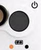{width=82px height=99px}

</td>
<td>

Если индикатор внешнего аккумулятор (справа) горит оранжевым, это указывает на низкий уровень заряда (менее ±27%, оставшееся время работы: ок. 20 минут). Это указывает на то, что скоро потребуется заменить текущий внешний аккумулятор заряженным аккумулятором. Если индикатор начинает мигать оранжевым, уровень заряда очень низкий (менее ±16%, оставшееся время работы: ок. 10 минут). Необходимо немедленно заменить текущий внешний аккумулятор заряженным.

Во время замены внешних аккумуляторов ORIONm автоматически перейдет на питание от встроенной батареи. Если внешний аккумулятор не подключен или прибор включен, правый индикатор не горит.

<color color="red">*Дополнительные сведения см. в разделе 3.1.3. Питание от аккумуляторов.*</color>

</td>
</tr>
</table>
