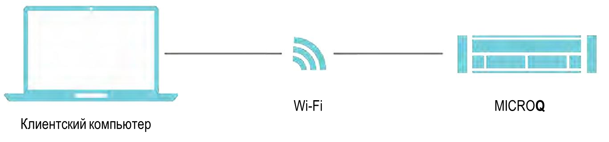

Прибор оснащен встроенным интерфейсом Wi-Fi IEEE 802.11b/g/nA с двумя потоками MIMO. Сетевой интерфейс Wi-Fi обеспечивает возможность использования ORIONm в мобильном режиме.

{width=1504px height=353px}

Конфигурация интерфейса Wi-Fi ORIONm по умолчанию следующая:

•           Режим точки доступа

•           SSID для Wi-Fi: ORIONm\_\[серийный номер на нижней стороне прибора\], например ORIONm_1234S5678

•           Число каналов: 6

•           Шифрование: отключено

•           Страна: Германия

•           IP-адрес: 192.168.2.204

•           Маска подсети: 255.255.255.0

•           Протокол mDNS включен с именем по умолчанию: ORIONm\_\[серийный номер на нижней стороне прибора\], например ORIONm_1234S5678

•           DHCP-сервер включен

Подключитесь к ORIONm, используя совместимое устройство Wi-Fi и SSID, указанный выше. Для проверки подключения введите IP-адрес по умолчанию как URL-адрес в адресной строке браузера, например: <http://192.168.2.204> . Имя mDNS по умолчанию также можно использовать в совместимых браузерах, например: <http://MicroQ> \_1234S5678.local.

В браузере должна открыться страница обзора системы ORIONm. Параметры конфигурации интерфейса Wi-Fi при запуске ORIONm можно изменить на страницах настройки сетевых параметров веб-сервера.

Для внесения изменений в настройки, следует выполнить следующие шаги: выберите страну «Россия» из предложенного списка. Из доступного перечня IP-адресов, предоставленного программой для выбранной страны, выберите новый IP-адрес, наиболее соответствующий вашим требованиям. Далее нажмите кнопку «Apply», чтобы подтвердить выбор и внести изменения. На завершающем этапе система может запросить пароль, введите в соответствуюещм окне «password».

ORIONm поддерживает эффективную скорость потоковой передачи Wi-Fi до 2,7 МБ/с. Учтите, что скорость подключения Wi-Fi прибора сильно зависит от параметров подключения, а также факторов внешней среды, включая, в том числе, расстояние, помехи и совместное использование полосы пропускания.

**Примечание:**

При настройке интерфейса Wi-Fi значения в полях «Страна», «IP-адрес» и «Маска подсети» могут отличаться в зависимости от страны, где вы настраиваете прибор.

