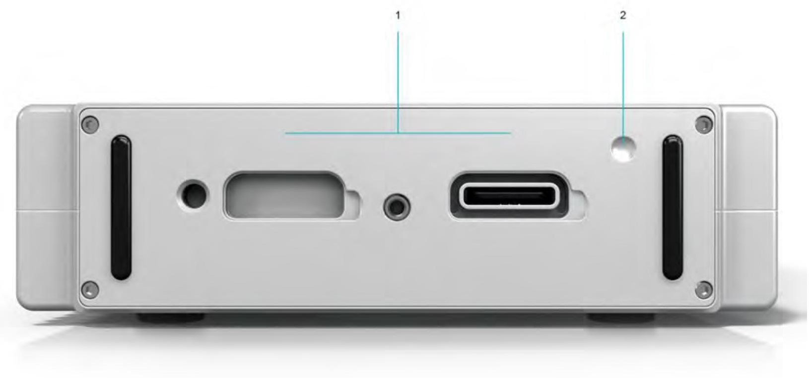

ORIONm может оснащаться встроенным аккумулятором (приобретается отдельно). Заряда аккумулятора хватает на 1–2 часа работы ORIONm в зависимости от конфигурации системы.

Для обеспечения еще 1–2 часов работы ORIONm в зависимости от конфигурации системы к прибору можно подключить внешний аккумулятор.

Благодаря возможности «горячей» замены внешних аккумуляторов время бесперебойной работы прибора заметно увеличивается (см. разделы ниже).

### **Подключение внешнего аккумулятора**

{width=1630px height=763px}

**1\.      Паз**

Специальный паз находится в верхнем правом углу внешнего аккумулятора (задняя панель) и ORIONm (задняя панель). Для подключения внешнего аккумулятора к ORIONm поднесите переднюю панель аккумулятора к задней панели прибора, выровняйте два паза, а затем вручную затяните колесико на аккумуляторе (см. рис. ниже).

**2\.      Колесико**

Поверните колесико по часовой стрелке (относительно задней панели аккумулятора), чтобы подсоединить аккумулятор, и против часовой стрелки, чтобы снять его.

### **Подача питания от встроенного и внешнего аккумулятора**

При подаче питания от встроенного и внешнего аккумулятора ORIONm получает питание в следующем порядке:

**1\.**      Сначала питание подается с внешнего аккумулятора.

**2\.**      Когда внешний аккумулятор разрядится, питание на ORIONm начнет поступать от встроенного аккумулятора.

**3\.**      На этом этапе разряженный внешний аккумулятор можно заменить новым, чтобы продлить время работы.

**4\.**      Когда оба аккумулятора будут разряжены, прибор выключится.

Обратите внимание, что встроенный аккумулятор нельзя зарядить от внешнего. Разряженные встроенные и внешние аккумуляторы заряжаются от источника питания пост. тока, PoE или путем установки в один из отсеков док-станции.

Дополнительные сведения об индикаторах состояния батарей <color color="red">см. в разделе 3.5\*. Индикаторы ORIONm.\*</color>

### **Зарядка аккумуляторов от источника питания пост. тока/PoE**

Стандартная поставка ORIONm предусматривает питание от блока питания пост. тока и PoE. Эти источники в случае необходимости можно использовать для зарядки встроенных и внешних аккумуляторов. При использовании встроенного и внешнего аккумулятора для питания ORIONm источник питания пост. тока или PoE можно использовать для их одновременной зарядки (ORIONm должен быть выключен\*). Если подключены и блок питания пост. тока, и PoE, блок питания является приоритетным источником. Аккумулятор (встроенный или внешний) с более низким уровнем заряда будет заряжаться первым. Если уровень заряда обоих аккумуляторов одинаков, они будут заряжаться одновременно.

Уровень заряда отображается индикаторами состояния батареи. <color color="red">Дополнительные сведения см. в разделе 3.5.2.5. Индикаторы состояния батареи (пункт 5 и 6)</color>

**Примечание:**

Зарядка встроенного или внешнего аккумулятора осуществляется только при выключенном приборе ORIONm. Это необходимо для снижения электрических помех во время измерений, а также во избежание перегрева прибора. Допустимый диапазон температур во время зарядки аккумуляторов: от 0 °C до 45 °C.