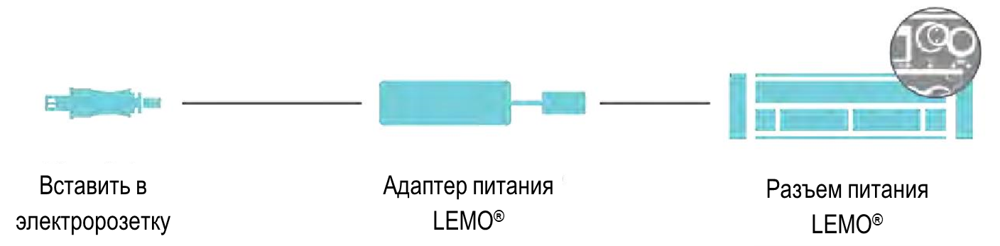

Для подключения ORIONm к источнику питания пост. тока используется разъем LEMO® рядом с выключателем питания на передней панели. В таблице ниже приведены характеристики источника питания пост. тока:

| **Разъем**                       | LEMO® EHG.0B.302    |
|----------------------------------|---------------------|
| **Диапазон входного напряжения** | 10–30 В пост. тока  |
| **Требуемая мощность**           | До 40 Вт            |
| **Рекомендуемый блок питания**   | Mean Well GST120A24 |

#### Подключение питания пост. тока

{width=1408px height=347px}

При питании ORIONm от рекомендуемого адаптера питания пост./перем. тока Mean Well AC/DC Power Adaptor питание подключается следующим образом:

**1\.**      Вставьте выходной кабель пост. тока адаптера питания в разъем питания LEMO® на передней панели ORIONm.

**2\.**      Подключите входной кабель перем. тока адаптера питания к подходящей розетке, а затем включите питание переменного тока от розетки. Следуйте инструкциям по эксплуатации и безопасности изготовителя адаптера питания.

**3\.**      Индикатор питания пост. тока ORIONm ненадолго загорится голубым (указывая, что обнаружен источник питания пост. тока), а затем зеленым, когда питание прибора будет включено.

**Примечание:**

Возможен заказ дополнительных кабелей питания пост. тока и принадлежностей. Свяжитесь с поставщиком для получения дополнительной информации.