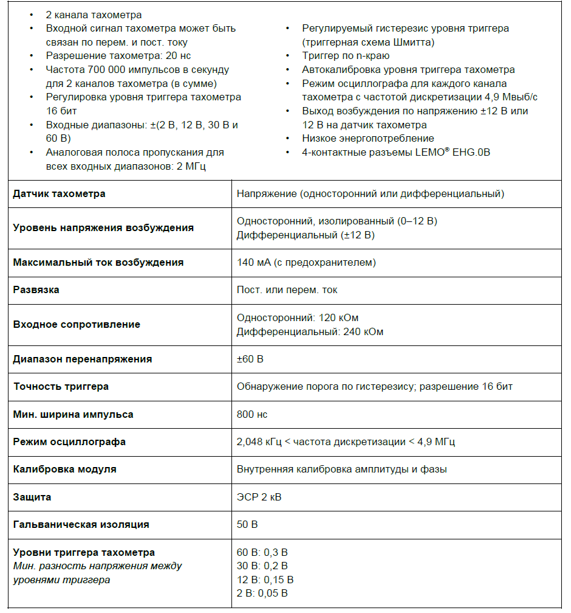
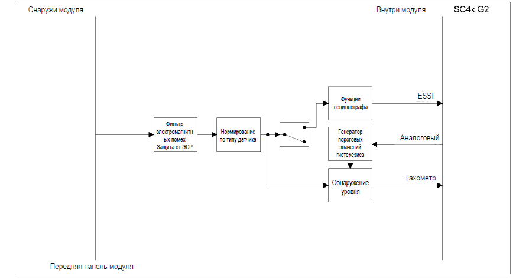
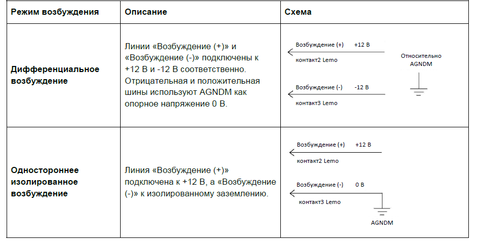

### **Описание**

Модуль 2xACC+ -- это гибридный модуль, сочетающий 2 канала модуля 4xACC и 2 входных расширенных канала тахометра. Каналы тахометра обеспечивают измерение периода тахометра с разрешением 20 нс: выборка производится, когда сигнал пересекает заданный уровень срабатывания. Триггер для сигналов тахометра можно настроить по переднему или заднему краю с регулируемым гистерезисом, дополнительно обеспечивая развязку по переменному току для датчиков с различными значениями смещения напряжения постоянного тока. Предусмотрен высокоскоростной режим осциллографа 4,9 Мвыб/с для просмотра сигналов тахометра -- это упрощает задание уровней триггера. Модуль можно использовать:

•           при измерении частоты повторения импульсов, а также времени между импульсами (например, оборотов в минуту и угла поворота коленчатого вала)

•           с любыми ICP®-датчиками, обычно применяемыми для измерения вибрации, ускорения, силы или давления

•           с любым источником напряжения до ±60 В в режиме ввода напряжения.

<image src="./modul-2xacc-ict42s.png" crop="0,0,100,100" scale="100" width="929px" height="405px"/>

##### *Модуль 2xACC+ с 3- и 4-контактным разъемом LEMO*® *EHG.0B: назначение контактов (если смотреть на разъем на лицевой панели).*

### **Функции**

{width=940px height=1008px}

### **Функциональная схема -- входной канал тахометра**

{width=890px height=473px}

##### *Функциональная схема 2xACC+ -- входной канал тахометра.*

Характеристики каналов 1 и 2 аналогичны первым двум каналам модуля 4xACC.

Дополнительные сведения о двух каналах входного сигнала напряжения или ICP® см. в описании модуля 4xACC.

Каналы 3 и 4 модуля *2xACC+* -- каналы тахометра, а также входного сигнала осциллографа. Каждый канал тахометра функционирует отдельно и подключен к собственному датчику тахометра. Каждый канал осциллографа отображает входные данные каналов тахометра. Можно настроить каналы осциллографа так, чтобы они отображали один канал тахометра.

В стандартной конфигурации модуля для каждого входного канала тахометра (на передней панели) предназначен 4-контактный разъем LEMO® . Два контакта разъема LEMO® выделены для сигнала тахометра. Два дополнительных контакта обеспечивают напряжение возбуждения, которое может служить источником питания для внешних датчиков тахометра. Линии «Возбуждение (+)» и «Возбуждение (-)» оснащены защитой от перегрузки по току -- автоматическим предохранителем на 140 мА. Два варианта вывода возбуждения показаны в таблице ниже.

{width=945px height=477px}

### **Варианты заземления на входной канал тахометра**

Для каждого входного канала тахометра модуля *2xACC+* предусмотрены следующие варианты заземления:

•           Дифференциальное смещение (балансируемое смещение):

\-     Оба входа подключены по линии 120 кОм к плавающему заземлению.

•           Несимметричное смещение (небалансируемое смещение):

\-     Один вход подключен по линии 120 кОм к плавающему заземлению, а другой -- напрямую к плавающему заземлению.

•           Несимметричное заземление (небалансируемое заземление):

\-     Один вход подключен по линии 120 кОм к плавающему заземлению, а другой -- напрямую к заземлению.

### **Схемы заземления**

<image src="./modul-2xacc-ict42s-5.png" crop="0,0,100,100" scale="100" width="687px" height="468px"/>

##### *Дифференциальное смещение (балансируемое смещение).*

<image src="./modul-2xacc-ict42s-6.png" crop="0,0,100,100" scale="100" width="673px" height="466px"/>

##### *Несимметричное смещение (небалансируемое смещение).*

<image src="./modul-2xacc-ict42s-7.png" crop="0,0,100,100" scale="100" width="675px" height="471px"/>

##### *Несимметричное заземление (небалансируемое заземление).*