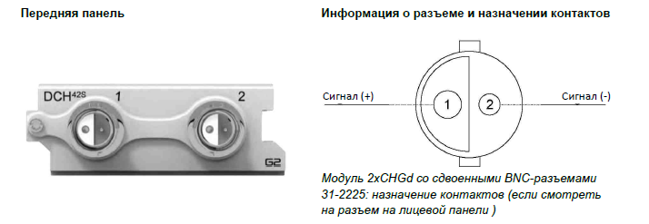
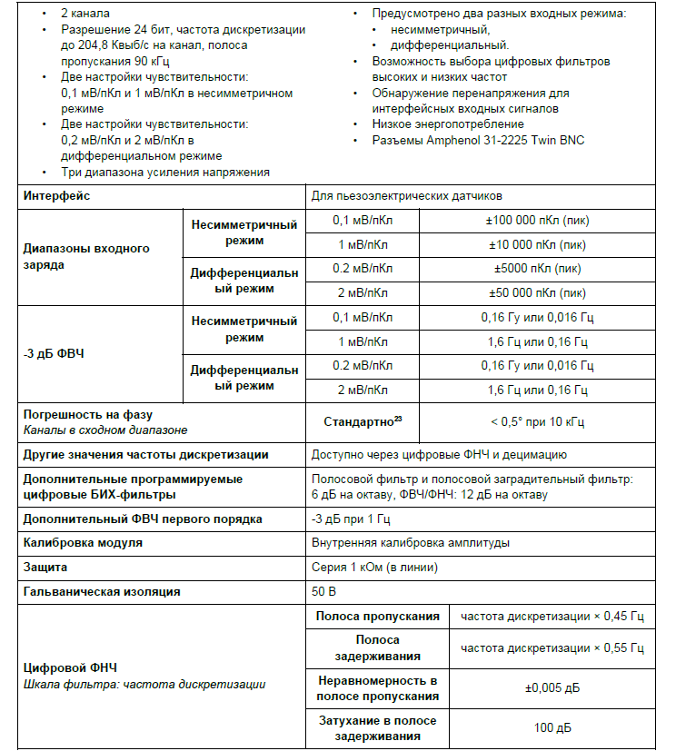
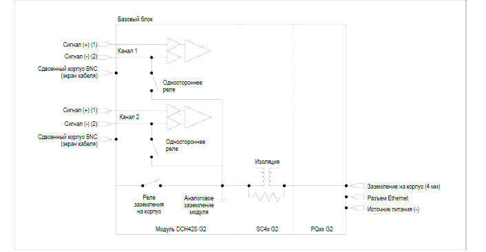

### **Описание**

Модуль 2xCHGd оснащен 2 независимыми дифференциальными входными каналами для кварцевых или пьезокерамических датчиков. Эти датчики, как правило, используются при необходимости получить более качественный сигнал, например с низким уровнем шумов и искажений, а также в случаях, когда из-за высоких температур и ядерной радиации невозможно использовать ICP®-датчики. Дополнительная функция дифференциального заряда обеспечивает дополнительную устойчивость к помехам и более высокую пропускную способности, что особенно важно для вариантов применения с длинными кабелями. Модуль можно использовать:

•           с пьезоэлектрическими датчиками, которые обычно используются для измерения вибрации, ускорения, силы, крутящего момента и давления

•           в системах с длинными кабелями из-за необходимости использовать балансируемые кабели «витая пара».

{width=714px height=247px}

**ПРЕДУПРЕЖДЕНИЕ ОБ ЭЛЕКТРОСТАТИЧЕСКИХ РАЗРЯДАХ**

Входы модуля 2xCHGd чувствительны к электростатическим разрядам. Прежде чем подключать кабель или разъем к модулю 2xCHGd, принимайте меры по снятию статического электричества, которое может на них накапливаться.

### **Функции**

{width=744px height=827px}

##### *Функции модуля  2xCHGd.*

### **Функциональная схема на канал**

{width=695px height=362px}

##### *Функциональная схема 2xCHGd на канал.*

### **Схема заземления**

{width=706px height=366px}

##### *Заземление модуля 2xCHGd.*