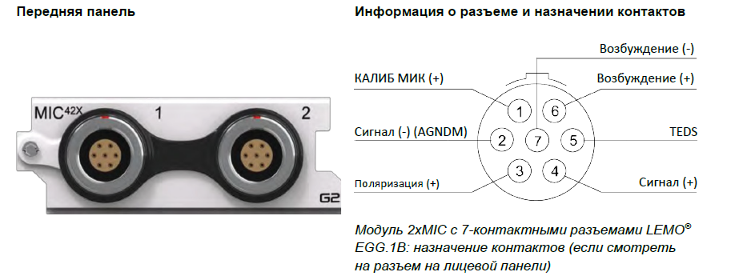
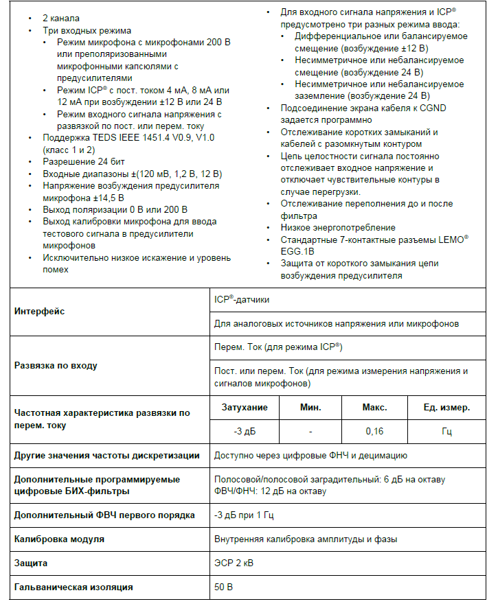
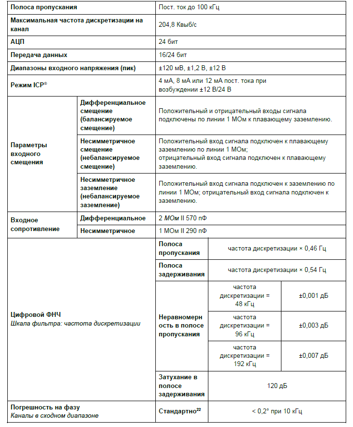
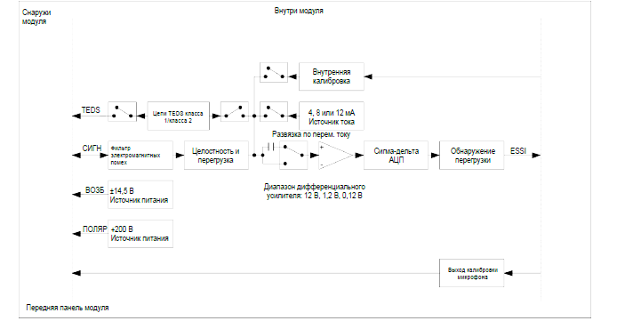
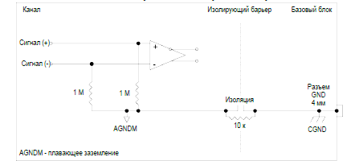
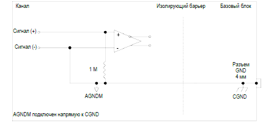
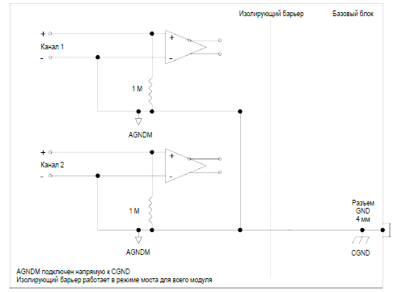
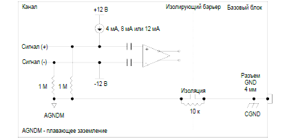
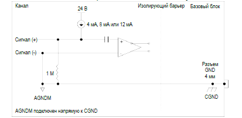

### **Описание**

Основное назначение модуля 2xMIC -- измерения с помощью микрофонов, однако он также поддерживает режимы входного сигнала напряжения и ICP®. Модуль можно использовать:

•           с любыми микрофонами 200 В или преполяризованными микрофонами с предусилителями

•           с любыми ICP®-датчиками, обычно применяемыми для измерения вибрации, ускорения, силы и давления

•           с любым источником напряжения до ±12 В в режиме ввода напряжения.

{width=918px height=350px}

### **Функции**

{width=725px height=883px}

### **Характеристики**

{width=725px height=876px}

<image src="./modul-2xmic-mic42x-4.png" crop="0,0,100,100" scale="93" width="710px" height="536px"/>

<image src="./modul-2xmic-mic42x-5.png" crop="0,0,100,100" scale="93" width="717px" height="532px"/>

##### *Характеристики модуля 2xMIC*

##### *Информация о параметрах модулей и условиях измерения, используемых во время измерений для определения технических характеристик, доступна по запросу.*

### **Функциональная схема на канал**

{width=694px height=361px}

##### *Схема прохождения сигнала модуля 2xMIC.*

### **Схемы заземления для режима измерения напряжения**

{width=447px height=200px}

##### *Дифференциальное смещение (балансируемое смещение).*

{width=451px height=207px}

##### *Несимметричное смещение (небалансируемое смещение).*

{width=448px height=202px}

##### *Несимметричное заземление (небалансируемое заземление).*

На рис. ниже показано влияние закрытого переключателя CGND на варианты входных режимов модуля. Изолирующий барьер будет работать в режиме моста для всего модуля. Поэтому любой канал, подключенный по дифференциальной развязке, будет выдавать 1 *М*Ом на CGND, а любой канал, подключенный по несимметричной развязке, будет подключен к несимметричному (небалансируемому) заземлению.

{width=502px height=361px}

##### *Влияние входного режима на модуль.*

### **Схемы заземления для режима ICP**®

{width=417px height=202px}

##### *Режим ICP*®*: дифференциальное смещение с возбуждением током 4 мА, 8 мА или 12 мА.*

{width=418px height=200px}

##### *Режим ICP*®*: несимметричное смещение с возбуждением током 4 мА, 8 мА или 12 мА.*

{width=413px height=202px}

##### *Режим ICP*®*: несимметричное заземление с возбуждением током 4 мА, 8 мА или 12 мА.*