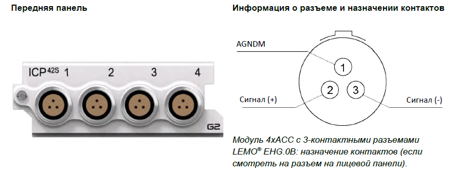
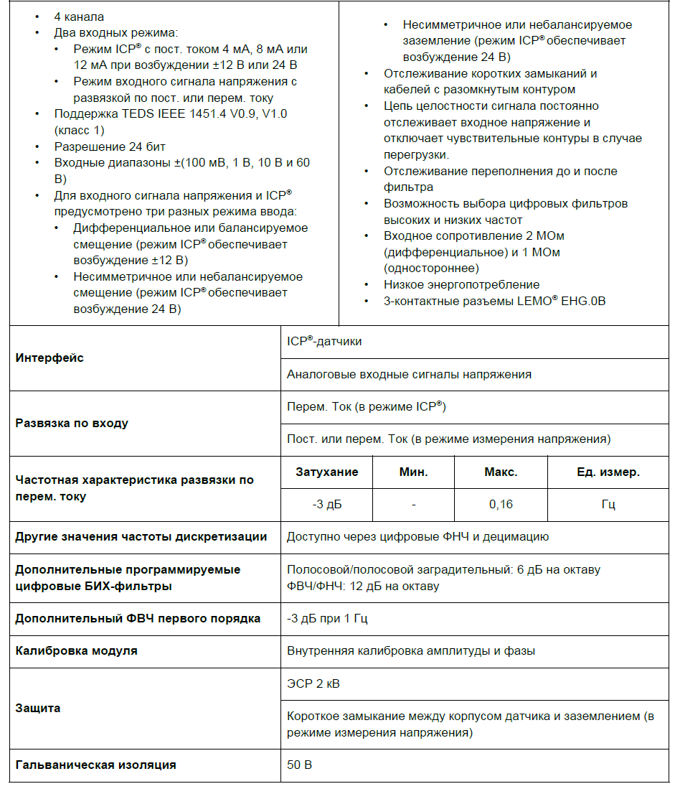
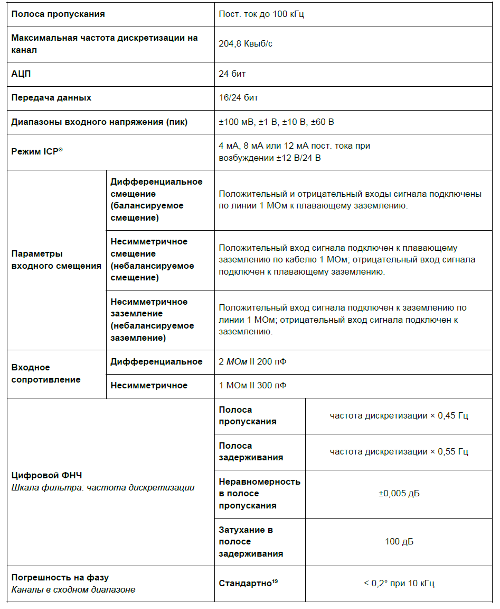
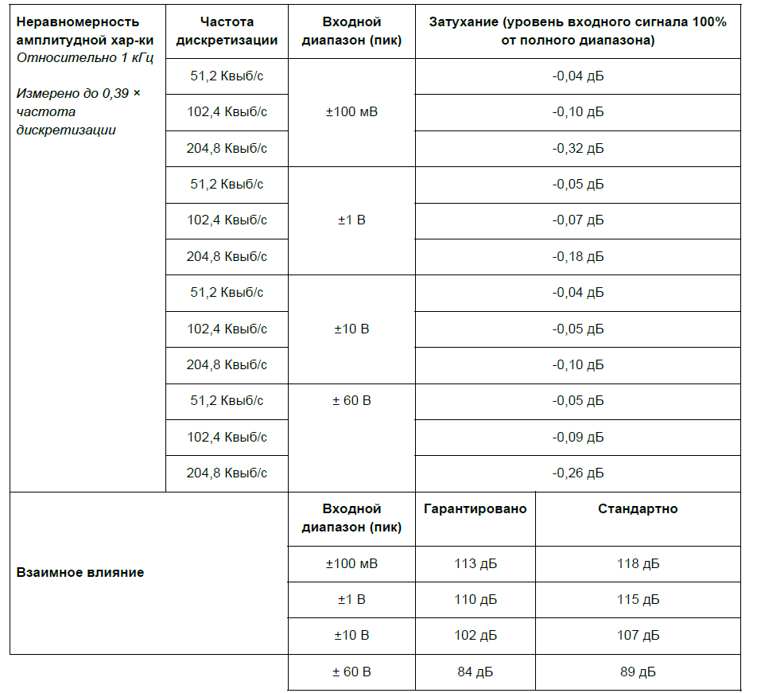
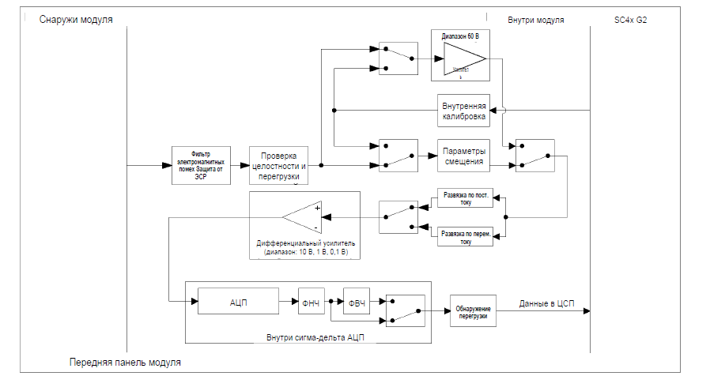

### **Описание**

Модуль 4xACC можно использовать с ICP®-акселерометрами, датчиками силы и давления, а также для измерения аналоговых сигналов напряжения. Все 4 канала работают независимо друг от друга. Для каждого можно отдельно настроить режим, усиление и развязку. Модуль можно использовать:

•           с любыми ICP®-датчиками, обычно применяемыми для измерения вибрации, ускорения, силы или давления

•           с любым источником напряжения до ±60 В в режиме ввода напряжения.

{width=896px height=337px}

### **Функции**

{width=941px height=1106px}

### **Характеристики**

{width=947px height=1151px}

<image src="./modul-4xacc-icp42s-4.png" crop="0,0,100,100" scale="100" width="951px" height="876px"/>

{width=957px height=871px}

##### *Информация о параметрах модулей и условиях измерения, используемых во время измерений для определения технических характеристик, доступна по запросу.*

### **Функциональная схема на канал**

{width=892px height=471px}

##### *Режим ICP*® *модуля 4xACC (на канал).*

{width=898px height=476px}

##### *Режим измерения напряжения модуля 4xACC (на канал).*

### **Варианты заземления**

Благодаря дополнительной шине питания 24 В модуля 4xACC обеспечивается расширенное общее заземление:

•           Дифференциальное смещение (балансируемое смещение):

\-     Возбуждение от -12 В до +12 В

\-     Оба входа подключены по линии 1 МОм к плавающему заземлению.

•           Несимметричное смещение (небалансируемое смещение):

\-     Возбуждение от 0 В до 24 В

\-     Один вход подключен по линии 1 МОм к плавающему заземлению, а другой -- напрямую к плавающему заземлению.

•           Несимметричное заземление (небалансируемое заземление):

\-     Возбуждение от 0 В до 24 В

\-    Один вход подключен к заземлению по кабелю 1 МОм, а другой -- к заземлению напрямую.

### **Схемы заземления: режим измерения напряжения**

<image src="./modul-4xacc-icp42s-8.png" crop="0,0,100,100" scale="89" width="607px" height="277px"/>

##### *Модуль 4xACC в режиме измерения напряжения с дифференциальным смещением (на канал).*

<image src="./modul-4xacc-icp42s-9.png" crop="0,0,100,100" scale="92" width="611px" height="276px"/>

##### *Модуль 4xACC в режиме изм. напряжения с несимметричным смещением (на канал).*

<image src="./modul-4xacc-icp42s-10.png" crop="0,0,100,100" scale="92" width="620px" height="275px"/>

##### *Несимметричное заземление модуля 4xACC (влияет на весь модуль).*

Для каждого канала *4xACC* можно задать собственный вариант заземления, однако при включении несимметричного заземления для одного канала все четыре канала подключаются к заземлению напрямую. Если один из каналов настроен таким образом, вариант заземления «несимметричное» задается в ПО автоматически.

<image src="./modul-4xacc-icp42s-11.png" crop="0,0,100,100" scale="73" width="532px" height="690px"/>

##### *Несимметричное заземление 4xACC влияет на все 4 канала.*

Аналогично режиму измерения напряжения для режима ICP® предусмотрено три варианта заземления. Однако для режима ICP® есть еще один вариант конфигурации, а именно значение тока возбуждения, подаваемого на подключенный датчик.

### **Схемы заземления: режим ICP**®

<image src="./modul-4xacc-icp42s-12.png" crop="0,0,100,100" scale="92" width="557px" height="278px"/>

##### *Модуль 4xACC в режиме ICP*® *с возбуждением током 4 мА, 8 мА или 12 мА и дифференциальным смещением.*

<image src="./modul-4xacc-icp42s-13.png" crop="0,0,100,100" scale="93" width="542px" height="273px"/>

##### *Модуль 4xACC в режиме ICP*® *с возбуждением током 4 мА, 8 мА или 12 мА и несимметричным смещением.*

<image src="./modul-4xacc-icp42s-14.png" crop="0,0,100,100" scale="92" width="548px" height="289px"/>

##### *Модуль 4xACC в режиме ICP*® *с возбуждением током 4 мА, 8 мА или 12 мА и несимметричным заземлением.*

