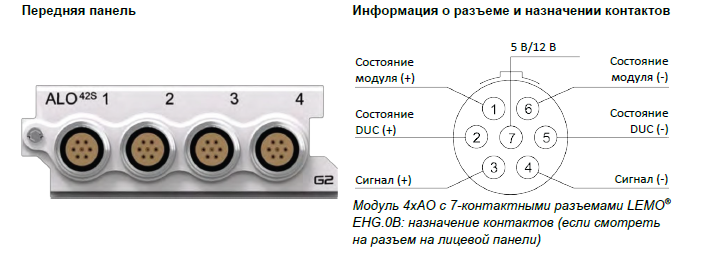
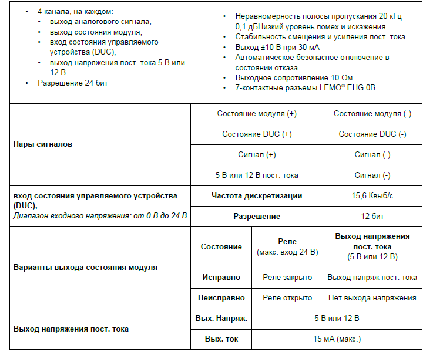
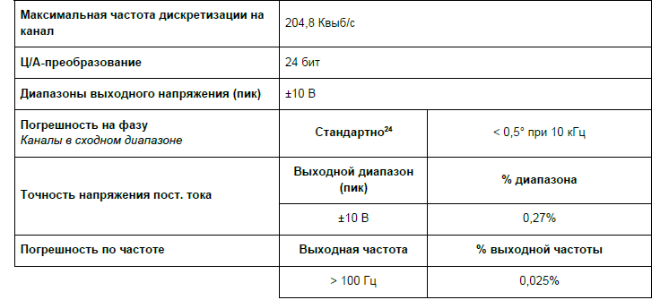
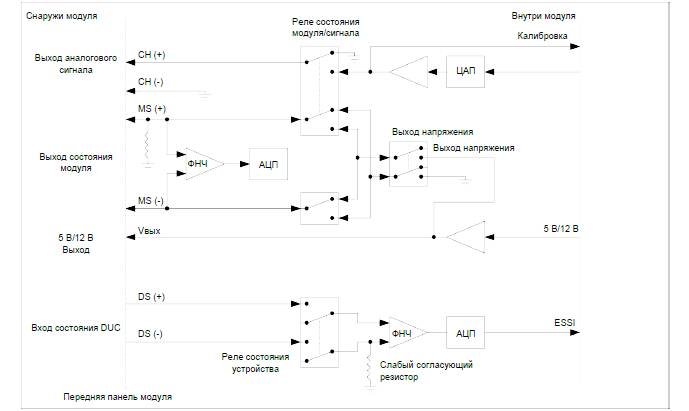

### **Описание**

Модуль 4xAO обеспечивает 4 независимых выходных канала для формирования аналоговых сигналов. Каждый канал также оснащен сигналами выхода и входа состояния, что обеспечивает возможности дальнейшего взаимодействия с внешним оборудованием, например для контроля над испытаниями и для управления рабочим процессом. Модуль 4xAO можно использовать для решения следующих задач:

•           сигналы возбуждения для вибростендов/модальных испытаний;

•           управляющий сигнал для акустических испытаний;

•           произвольные аналоговые сигналы для подачи в другие цепи, требующие динамических или статических сигналов ±10 В.

{width=714px height=255px}

### **Функции**

{width=737px height=605px}

<image src="./modul-4xao-alo42s-3.png" crop="0,0,100,100" scale="95" width="733px" height="253px"/>

##### *Функции модуля  4xAO.*

### **Характеристики**

{width=746px height=335px}

##### *Характеристики модуля  4xAO*

##### *Информация о параметрах модулей и условиях измерения, используемых во время измерений для определения технических характеристик, доступна по запросу.*

### **Функциональная схема на канал**

{width=689px height=411px}

##### *Функциональная схема 4xAO на канал.*

Управляемое устройство (DUC) подключается к модулю 4xAO через 7-контактный разъем LEMO®:

•по двум линиям аналогового сигнала (CH (+) и CH (-)) передается аналоговая информация;

•по двум линиям выхода состояния модуля (MS (+) и MS (-)) данные из модуля 4xAO передаются на управляемое устройство;

•по двум линиям входа состояния DUC (DS (+) и DS (-)) данные от управляемого устройства поступают в модуль 4xAO.

•Выход пост. тока 5 В или 12 В

### **Схема заземления**

{width=693px height=411px}

##### *Заземление модуля 4xAO.*

Разъем LEMO® на модуле 4xAO контактирует с экраном кабеля, подключенного к управляемому устройству. По этой причине необходим разрыв экрана на стороне управляемого устройства, чтобы избежать подсоединения этого устройства к заземлению на корпус системы.

Этот разъем LEMO® также подключен к 4-мм разъему заземления на корпус в нижнем правом углу передней панели ORION, экрану разъема Ethernet и отрицательному контакту источника питания ORION.