**Описание**

Модуль 4xCHG оснащен 4 независимыми входными каналами для кварцевых или пьезокерамических датчиков. Эти датчики, как правило, используются при необходимости получить более качественный сигнал, например с низким уровнем шумов и искажений, а также в случаях, когда из-за высоких температур или ядерной радиации невозможно использовать ICP®-датчики. Различные варианты заземления позволяют проводить измерения с низким уровнем шумов независимо от внешних ограничений заземления.

Модуль можно использовать: с пьезоэлектрическими датчиками, которые обычно используются для измерения вибрации, ускорения, силы, крутящего момента и давления.

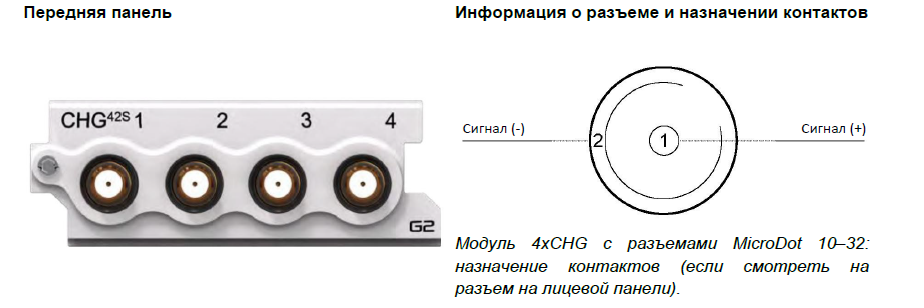{width=924px height=308px}

### **ПРЕДУПРЕЖДЕНИЕ ОБ ЭЛЕКТРОСТАТИЧЕСКИХ РАЗРЯДАХ**

Входы модуля 4xCHG чувствительны к электростатическим разрядам. Прежде чем подключать кабель или разъем к модулю 4xCHG, принимайте меры по снятию статического электричества, которое может на них накапливаться.

### **Функции**

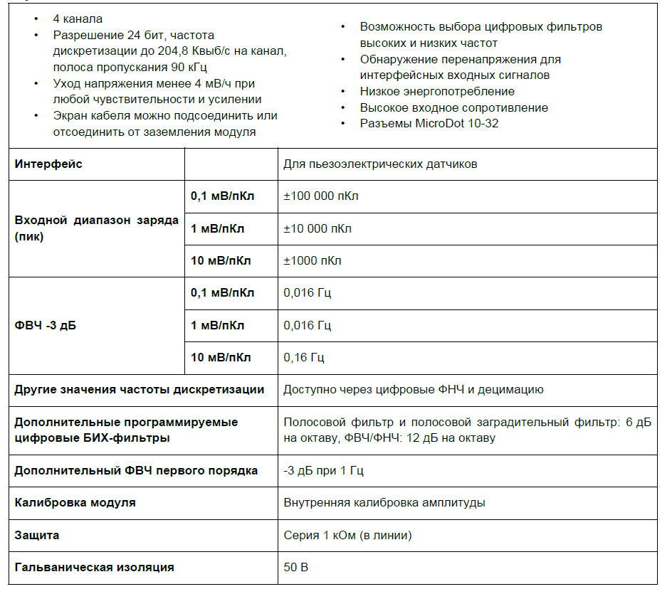{width=944px height=835px}

### **Характеристики**

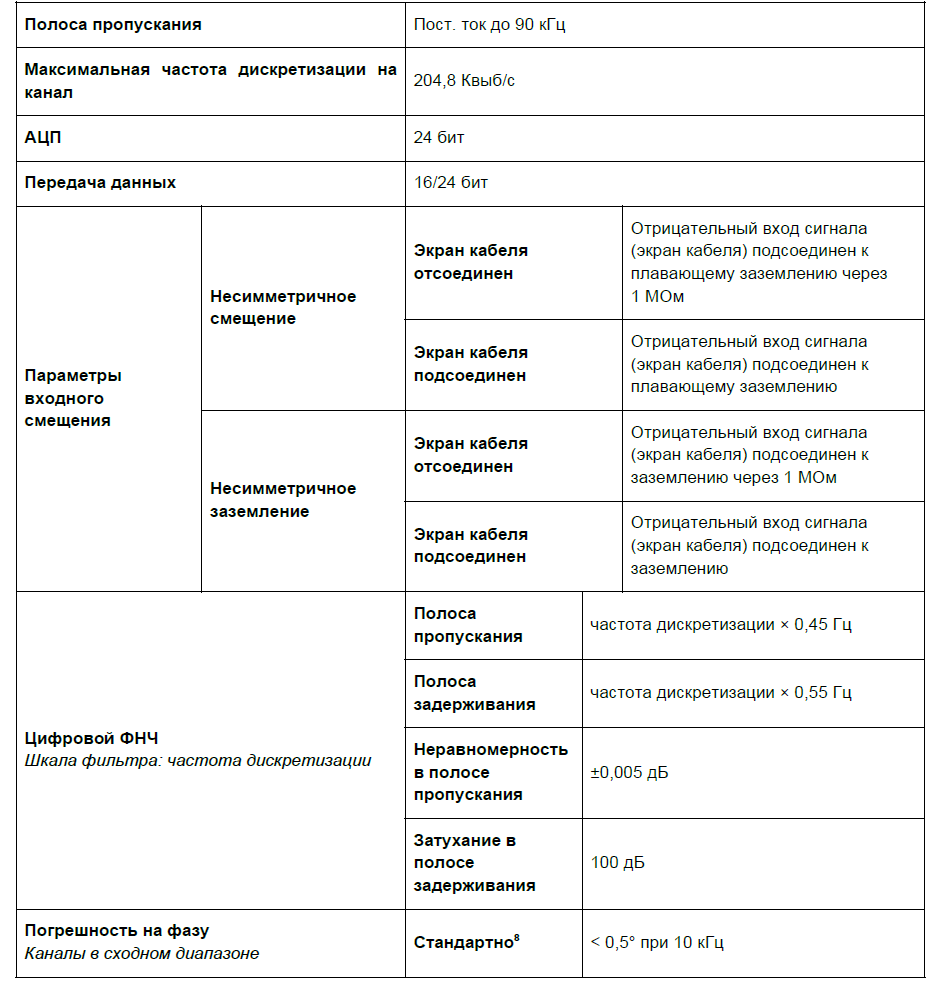{width=951px height=998px}

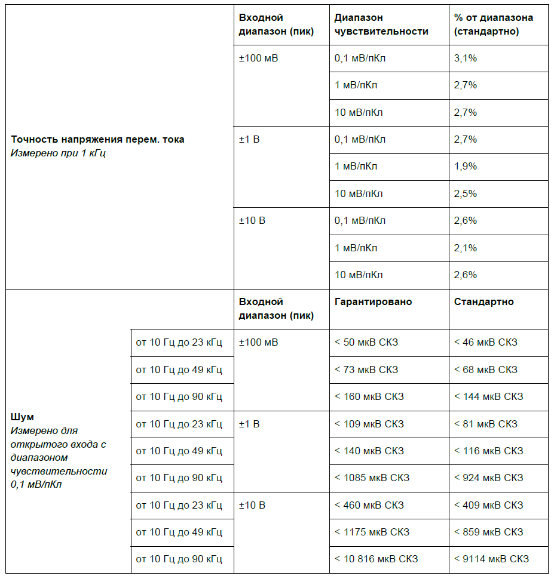{width=927px height=980px}

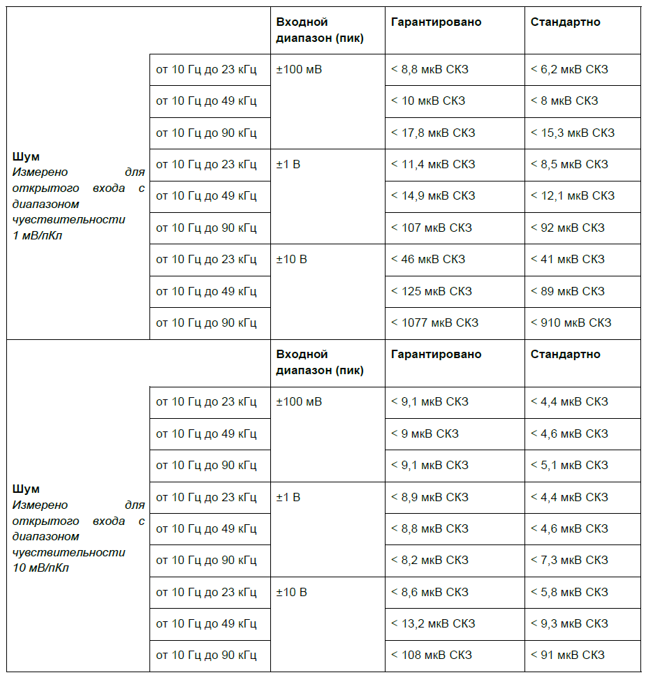{width=935px height=977px}

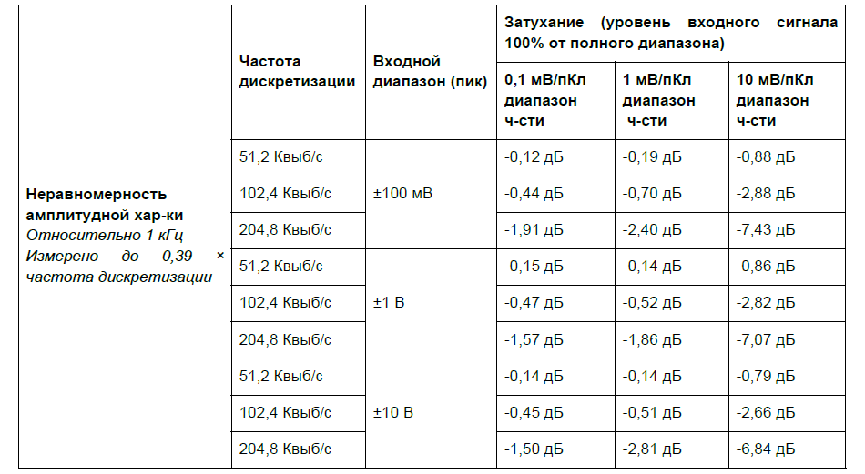{width=950px height=521px}

### **Взаимное влияние**

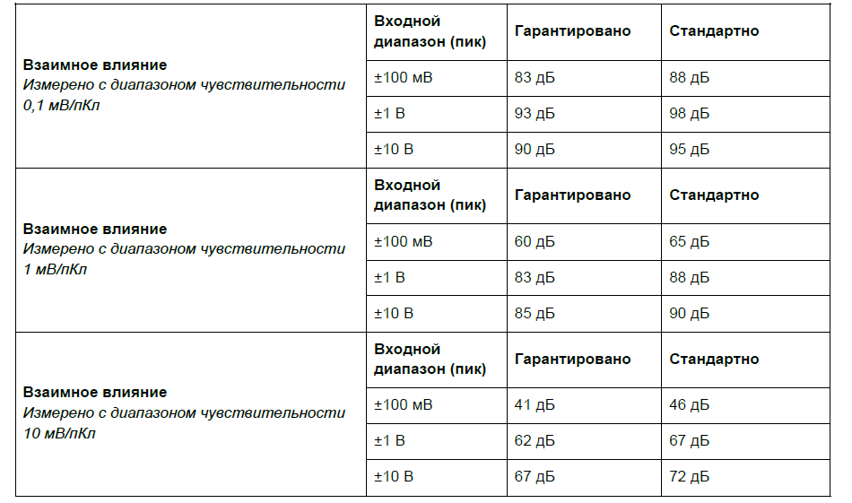{width=950px height=561px}

*Информация о параметрах модулей и условиях измерения, используемых во время измерений для определения технических характеристик, доступна по запросу.*

### **Функциональная схема на канал**

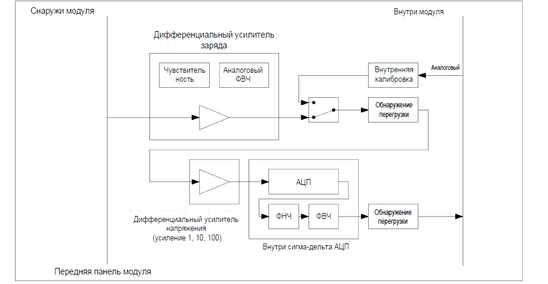{width=917px height=476px}

*Обзор функций одного канала 4xCHG.*

#### **Схема заземления**

Для модуля 4xCHG предусмотрено 4 варианта заземления. Они служат для снижения электромагнитных помех, которые могут присутствовать в кабелях датчиков.

| **Модуль**  | **Экран кабеля подсоединен** | **Тип**        | **Экран-корпус** |
|-------------|------------------------------|----------------|------------------|
| \*Плавающее | \*Нет                        | Плавающее      | 1 МОм + 10 кОм   |
| Плавающее   | Да                           | \-             | 10 кОм           |
| Заземлено   | Нет                          | \-             | 1 МОм            |
| Заземлено   | Да                           | Несимметричное | \< 20 Ом         |

*Варианты заземления*

\* Значение по умолчанию при запуске модуля. Эта комбинация обеспечивает путь для медленного снятия электростатического разряда, а также некоторую защиту от быстрых разрядов, которые могут повредить чувствительные входы сигнала заряда.

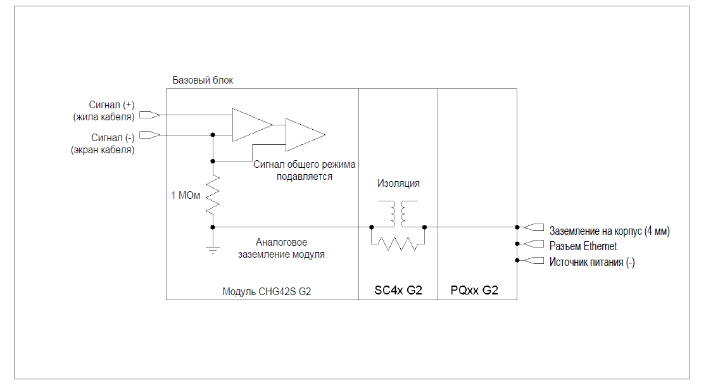{width=1115px height=608px}

##### *Схема заземления 4xCHG: плавающее заземление модуля, экран кабеля отсоединен.*

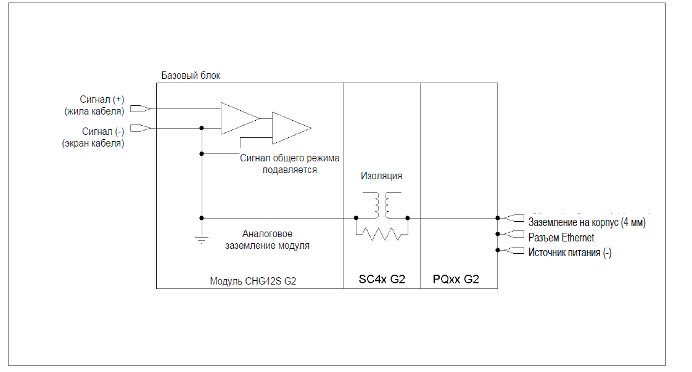{width=1122px height=604px}

##### *Схема заземления 4xCHG: плавающее заземление модуля, экран кабеля подсоединен.*

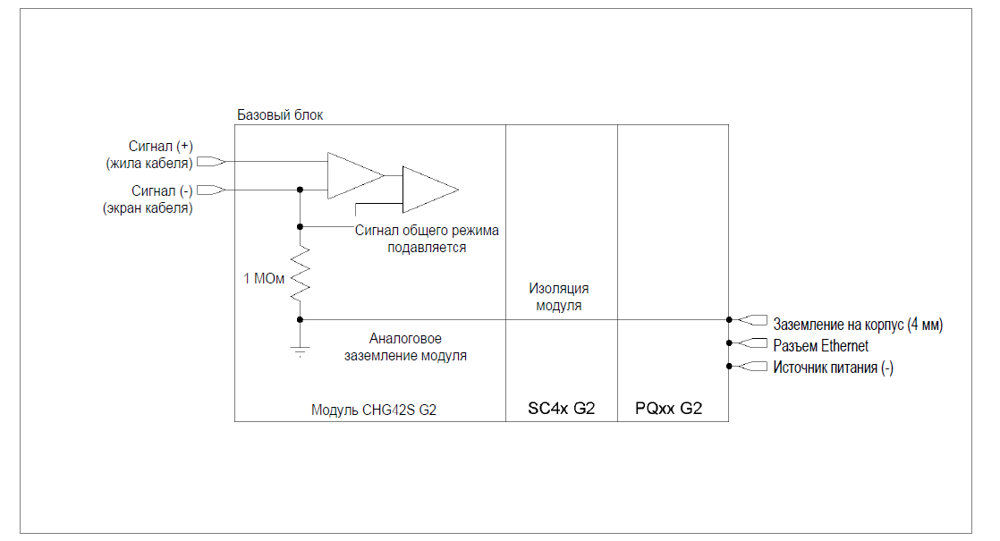{width=1118px height=605px}

##### *Схема заземления 4xCHG: модуль заземлен, экран кабеля отсоединен.*

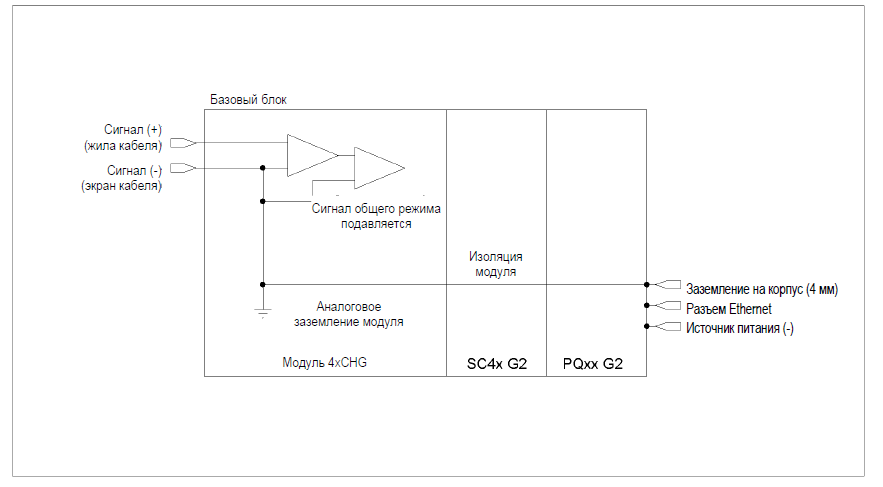{width=883px height=487px}

##### *Схема заземления 4xCHG: модуль заземлен, экран кабеля подсоединен.*

