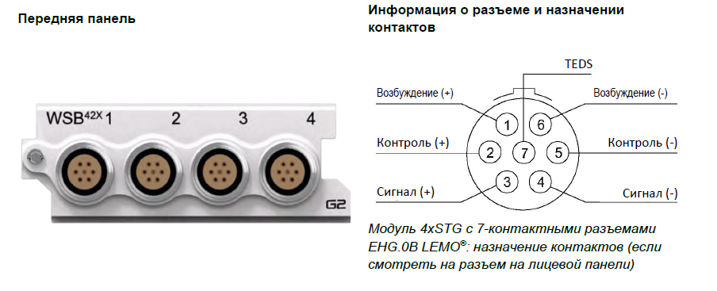
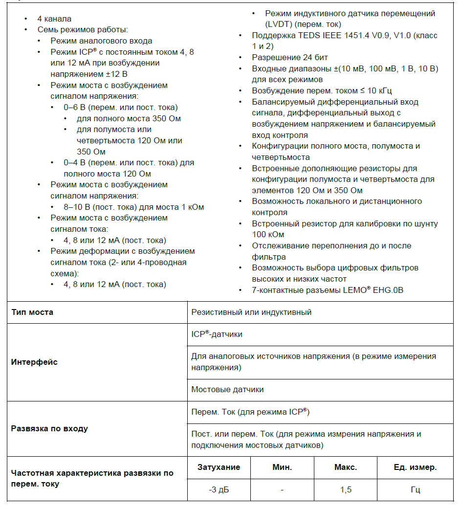
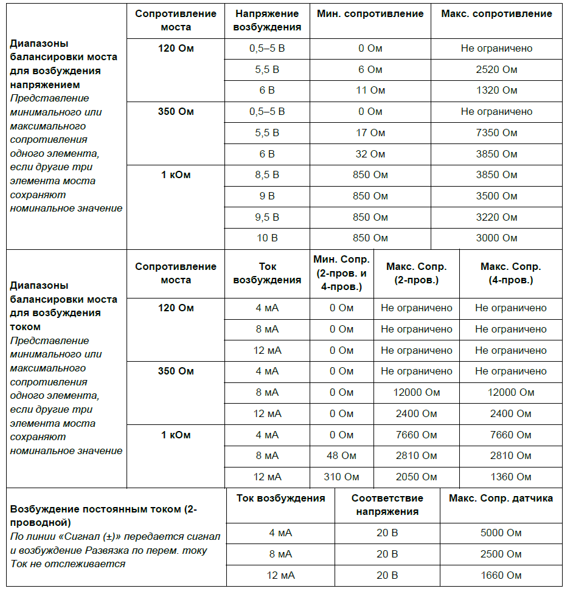

### **Описание**

Модуль 4xSTG используется для измерений перем. и пост. тока по мостовой схеме, включая тензодатчики в конфигурации полного моста, полумоста или четвертьмоста и индуктивными датчиками перемещений (LVDT). Модуль поддерживает широкий ряд программно выбираемых функций, таких как возбуждение постоянным напряжением (перем. или пост. ток) и возбуждение постоянным током (пост. ток), контроль моста, дополняющие резисторы, калибровка по шунту, режим динамической деформации и поддержка датчиков ICP®. Балансировка моста может выполняться по команде, кроме того, можно применять предыдущее значение балансировки. Модуль можно использовать:

•           с любыми тензодатчиками в режиме четверть-, полу- и полного моста, датчиками нагрузки и измерительными датчиками давления

•           с индуктивными датчиками перемещений (LVDT)

•           с любым источником напряжения до ±10 В в режиме ввода напряжения

•           с датчиками, возбуждаемыми сигналом тока, в 4-проводной схеме (полный мост или 1 внешний элемент, пост. или перем. ток)

•           с датчиками, возбуждаемыми сигналом тока, в 2-проводной схеме (только динамическая деформация)

•           с любыми ICP®-датчиками, обычно применяемыми для измерения вибрации, ускорения, силы или давления.

{width=904px height=367px}

### **Функции**

{width=945px height=1043px}

{width=942px height=982px}

<image src="./modul-4xstg-wsb42x-4.png" crop="0,0,100,100" scale="100" width="946px" height="916px"/>

### **Характеристики**

<image src="./modul-4xstg-wsb42x-5.png" crop="0,0,100,100" scale="100" width="744px" height="833px"/>

<image src="./modul-4xstg-wsb42x-6.png" crop="0,0,100,100" scale="100" width="741px" height="809px"/>

<image src="./modul-4xstg-wsb42x-7.png" crop="0,0,100,100" scale="100" width="733px" height="933px"/>

##### *Характеристики малоемкостного режима модуля 4xSTG.*

##### *Информация о параметрах модулей и условиях измерения, используемых во время измерений для определения технических характеристик, доступна по запросу.*

### Характеристики малоемкостного режима

<image src="./modul-4xstg-wsb42x-8.png" crop="0,0,100,100" scale="100" width="746px" height="500px"/>

<image src="./modul-4xstg-wsb42x-9.png" crop="0,0,100,100" scale="100" width="725px" height="629px"/>

<image src="./modul-4xstg-wsb42x-10.png" crop="0,0,100,100" scale="100" width="739px" height="680px"/>

<image src="./modul-4xstg-wsb42x-11.png" crop="0,0,100,100" scale="100" width="738px" height="895px"/>

##### *Характеристики малоемкостного режима модуля 4xSTG.*

##### *Информация о параметрах модулей и условиях измерения, используемых во время измерений для определения технических характеристик, доступна по запросу.*

### **Функциональная схема на канал**

<image src="./modul-4xstg-wsb42x-12.png" crop="0,0,100,100" scale="96" width="718px" height="373px"/>

##### *Функциональная схема модуля  4xSTG.*

### **Заземление модуля**

Линии входных сигналов 4xSTG привязаны только к внутреннему заземлению модуля. На рис. ниже внутреннее заземление модуля обозначено как AGND, а заземление на корпус системы -- как CGND. Между AGND и CGND может существовать разность потенциалов до 50 В. В случае превышения 50 В активируются защитные цепи модуля и разность потенциалов фиксируется в пределах безопасного уровня.

Для экранированных датчиков, подключенных к CGND, линии положительного и отрицательного сигнала могут смещаться максимум до 50 В выше или ниже CGND.

<image src="./modul-4xstg-wsb42x-13.png" crop="0,0,100,100" scale="99" width="692px" height="372px"/>

##### *Заземление с дифференциальным смещением (балансируемым смещением).*

Этот вариант заземления применим ко всем режимам измерения.

### **Контроль напряжения**

Возбуждение по сигналу напряжения может отслеживаться по линиям контроля («Контроль (+)» и «Контроль (-)»). Контроль может осуществляться внешними средствами путем подключения двух специальных линий контроля от модуля к мосту. Внутренние линии контроля связаны с измерением напряжения возбуждения в модуле -- внешние линии контроля не требуются.

Возбуждение напряжения измеряется и преобразуется в разрешение 24 бит с помощью специального АЦП. Максимальная частота дискретизации для канала контроля составляет 204,8 кВыб/с в большинстве условий и, как правило, отражает частоту дискретизации, заданную для канала сигнала.

Контроль возбуждения напряжением обеспечивает точность первоначальной настройки напряжения возбуждения.

На следующих схемах показаны мосты Уитстона, возбуждаемые напряжением, с реализацией внешнего и внутреннего контроля в конфигурации полного моста, полумоста и четвертьмоста.

<image src="./modul-4xstg-wsb42x-14.png" crop="0,0,100,100" scale="99" width="716px" height="362px"/>

##### *6-проводная конфигурация моста с 4 внешними элементами моста (внешний контроль).*

<image src="./modul-4xstg-wsb42x-15.png" crop="0,0,100,100" scale="100" width="697px" height="357px"/>

##### *5-проводная конфигурация моста с 2 внешними элементами моста (внешний контроль).*

<image src="./modul-4xstg-wsb42x-16.png" crop="0,0,100,100" scale="100" width="694px" height="363px"/>

##### *4-проводная конфигурация моста с 4 внешними элементами моста (внутренний контроль).*

<image src="./modul-4xstg-wsb42x-17.png" crop="0,0,100,100" scale="100" width="693px" height="360px"/>

##### *3-проводная конфигурация моста с 2 внешними элементами моста (внутренний контроль).*

<image src="./modul-4xstg-wsb42x-18.png" crop="0,0,100,100" scale="100" width="685px" height="361px"/>

##### *3-проводная конфигурация моста с 1 внешним элементом моста (всегда внутренний контроль).*

### **Возбуждение постоянным током**

<image src="./modul-4xstg-wsb42x-19.png" crop="0,0,100,100" scale="100" width="713px" height="360px"/>

##### *4-проводная конфигурация моста с 4 внешними элементами.*

<image src="./modul-4xstg-wsb42x-20.png" crop="0,0,100,100" scale="100" width="702px" height="367px"/>

##### *4-проводная конфигурация моста с 1 внешним элементом.*

<image src="./modul-4xstg-wsb42x-21.png" crop="0,0,100,100" scale="100" width="697px" height="362px"/>

##### *2-проводная конфигурация моста с 1 внешним элементом (без отслеживания тока).*

Возбуждение датчиков током 12 мА от источников питания ±12 В существенно повышает энергопотребление модуля. Возбуждение током 12 мА рекомендуется использовать только для длинных кабелей в случаях, когда требуется широкая полоса пропускания сигнала. На схеме показаны типичные варианты настройки подключений для возбуждения постоянным током.

### **Калибровка по шунту**

Калибровка по шунту -- это способ моделирования деформации в мостовом датчике. Это распространенный и удобный способ проверки усиления и точности оборудования без необходимости вскрывать датчик, чтобы получить входные значения физических параметров.

Калибровка по шунту подразумевает шунтирование одного из плеч моста Уитстона резистором с известным сопротивлением. Соответствующие отклонения в выходном напряжении моста выражаются в мВ/В или мВ/мА возбуждения.

В частности, данные, полученные при калибровке по шунту, можно использовать для проверки корректности работы прибора, выбора правильного входного диапазона и применения правильных коэффициентов тензочувствительности и масштабирования в последующих вычислениях.

Калибровку по шунту можно выполнять для любой конфигурации моста.

В таблице ниже приведены обобщенные выходные данные калибровки для ненагруженных мостов с незначительным сопротивлением проволочного вывода и коэффициентом тензочувствительности, равным 2.

<table header="row">
<tr>
<td>

**Номинальное сопротивление моста**

**(Ом)**

</td>
<td>

**Шунтирующий**

**резистор**

**(кОм)**

</td>
<td>

**Выход моста с возбуждением напряжением (мВ/В)**

</td>
<td>

**Выход моста с возбуждением током (мВ/мА)**

</td>
<td>

**Эквив. микродеформация (для мостового**

**коэфф. 1)**

</td>
<td>

**Тип моделирования**

</td>
</tr>
<tr>
<td>

120

</td>
<td>

100

</td>
<td>

0,30

</td>
<td>

0,04

</td>
<td>

599

</td>
<td>

Сжатие

</td>
</tr>
<tr>
<td>

350

</td>
<td>

100

</td>
<td>

0,87

</td>
<td>

0,31

</td>
<td>

1744

</td>
<td>

Сжатие

</td>
</tr>
<tr>
<td>

1000

</td>
<td>

100

</td>
<td>

2,49

</td>
<td>

2,49

</td>
<td>

4950

</td>
<td>

Сжатие

</td>
</tr>
</table>

##### *Выходные данные калибровки по шунту.*

Эквивалентная цепь калибровки по шунту для возбуждения сигналом напряжения показана на рис. ниже. Путь шунтирующего резистора выделен красным.

<image src="./modul-4xstg-wsb42x-22.png" crop="0,0,100,100" scale="100" width="720px" height="358px"/>

##### *Калибровка по шунту для 6-проводной конфигурации моста с 4 внешними элементами моста в режиме возбуждения напряжением.*

Эквивалентная цепь калибровки по шунту для возбуждения сигналом тока показана на рис. ниже. Путь шунтирующего резистора выделен красным.

<image src="./modul-4xstg-wsb42x-23.png" crop="0,0,100,100" scale="100" width="711px" height="368px"/>

##### *Калибровка по шунту для 4-проводной конфигурации моста с 4 внешними элементами моста в режиме возбуждения током.*

