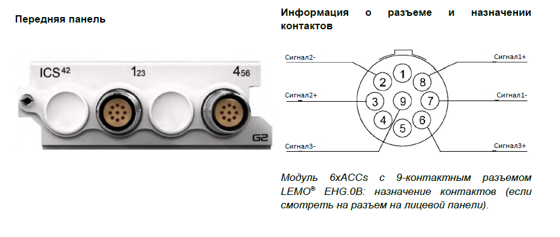
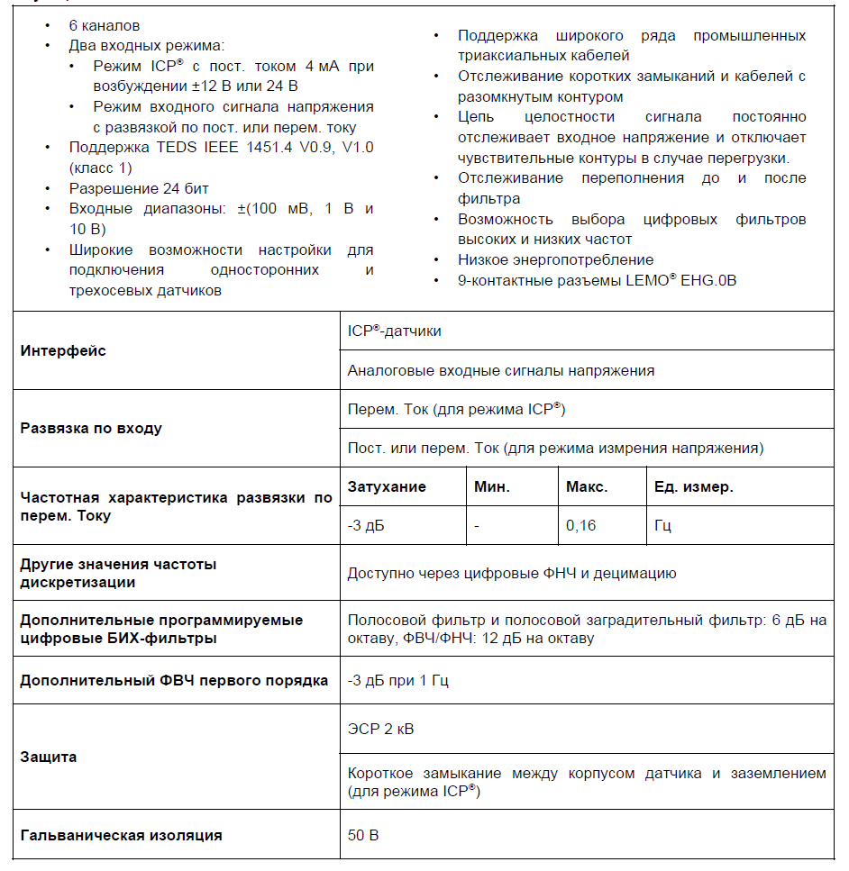
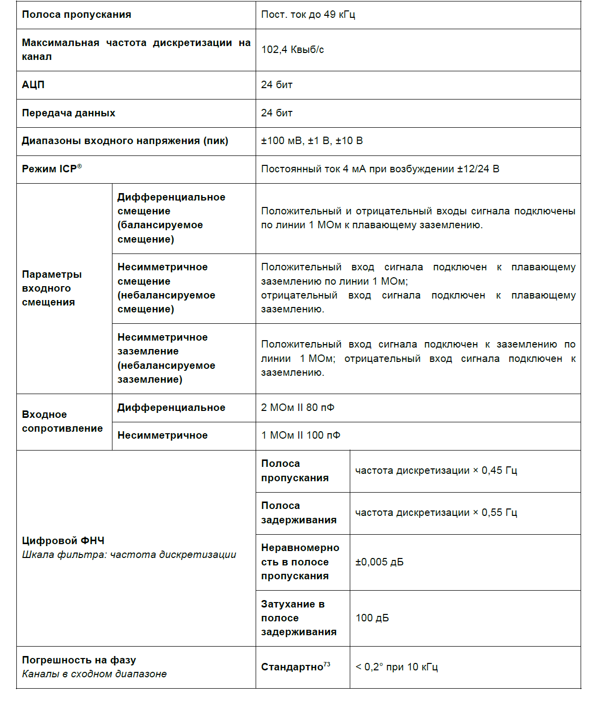
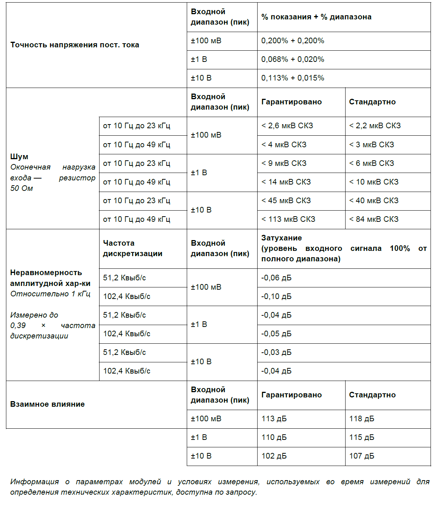

### **Описание**

Модуль 6xACCs можно использовать с ICP®-акселерометрами, датчиками силы и давления, а также для измерения аналоговых сигналов напряжения. Все 6 каналов работают независимо друг от друга. Для каждого можно отдельно настроить режим, усиление и развязку. Модуль можно использовать:

•           с любыми ICP®-датчиками, обычно применяемыми для измерения вибрации, ускорения, силы или давления

•           с любым источником напряжения до ±10 В в режиме ввода напряжения

{width=917px height=389px}

### **Функции**

{width=942px height=967px}

### **Характеристики**

{width=1197px height=1428px}

{width=1175px height=1360px}

### **Функциональная схема на канал**

{width=1106px height=593px}

##### *Режим измерения напряжения модуля 6xACCs (на канал).*

{width=1128px height=590px}

##### *Режим ICP*® *модуля 6xACCs (на канал).*

#### **Подключение акселерометров**

6xACCs поддерживает входные сигналы от одно- и трехосевых акселерометров ICP®. Конфигурация разъемов на передней панели обеспечивает удобное подключение к двум трехосевым датчикам на модуль. На схеме назначения контактов 9-контактного разъема LEMO® EHG.0B показаны контакты для подключения сигнала по каждой оси X, Y и Z и общего выхода трехосевого датчика.

{width=937px height=610px}

### **Варианты заземления**

Для модуля 6xACCs предусмотрено четыре варианта заземления режима изм. напряжения (аналоговый вход):

•           Дифференциальное смещение (балансируемое смещение):

\-     Оба входа подключены по линии 1 МОм к плавающему заземлению.

•           Дифференциальное заземление (балансируемое заземление):

\-     Оба входа подключены по линии 1 МОм напрямую к заземлению.

•           Несимметричное смещение (небалансируемое смещение):

\-     Один вход подключен по линии 1 МОм к плавающему заземлению, а другой -- напрямую к плавающему заземлению.

•           Несимметричное заземление (небалансируемое заземление):

\-     Один вход подключен по линии 1 МОм к плавающему заземлению, а другой -- напрямую к заземлению.

### **Схемы заземления: режим изм. напряжения**

<image src="./modul-6xaccs-ics42-8.png" crop="0,0,100,100" scale="98" width="690px" height="314px"/>

##### *Модуль* 6xACCs *в режиме изм. напряжения с дифференциальным смещением (на канал)*

<image src="./modul-6xaccs-ics42-9.png" crop="0,0,100,100" scale="98" width="595px" height="313px"/>

##### ***Модуль*** **6xACCs *в режиме изм. напряжения с несимметричным смещением (на канал)***

<image src="./modul-6xaccs-ics42-10.png" crop="0,0,100,100" scale="98" width="559px" height="286px"/>

##### ***Модуль*** **6xACCs *в режиме изм. напряжения с дифференциальным заземлением (влияет на весь модуль)***

<image src="./modul-6xaccs-ics42-11.png" crop="0,0,100,100" scale="97" width="551px" height="282px"/>

##### ***Модуль*** **6xACCs *в режиме изм. напряжения с несимметричным заземлением (влияет на весь модуль)***

Для каждого канала модуля 6xACCs тип заземления можно настроить отдельно, однако при выборе варианта заземления на любом одном канале изолирующий барьер модуля переходит в режим моста (т.е. AGNDM всех 6 каналов будут напрямую подключены к CGND).

<image src="./modul-6xaccs-ics42-12.png" crop="0,0,100,100" scale="78" width="514px" height="589px"/>

##### ***Настройка заземления*** **6xACCs *влияет на все 6 каналов.***

### **Схемы возбуждения: режим ICP**®

При использовании режима входа ICP® с возбуждением током 4 мА предусмотрено два варианта смещения. Настройки смещения не зависят от вариантов заземления. В таблице ниже приведены различные возможные настройки модуля 6xACCs в режиме входа ICP®:

| **Напряжение возбуждения** | **Параметры смещения**              | **Варианты заземления**             |
|----------------------------|-------------------------------------|-------------------------------------|
| ±12 В (симметричное)       | Дифференциальное                    | Заземление или плавающее заземление |
| 24 В (асимметричное)       | Дифференциальное или несимметричное | Заземление или плавающее заземление |

*Настройки модуля 6xACCs в режиме входа ICP*® *с возбуждением током 4 мА*

<image src="./modul-6xaccs-ics42-13.png" crop="0,0,100,100" scale="96" width="598px" height="319px"/>

##### ***Модуль 6xACCs в режиме ICP***® ***с возбуждением током 4 мА, выбрано возбуждение ±12 В, дифференциальное смещение и плавающее заземление***

<image src="./modul-6xaccs-ics42-14.png" crop="0,0,100,100" scale="95" width="584px" height="310px"/>

##### ***Модуль 6xACCs в режиме ICP***® ***с возбуждением током 4 мА, выбрано возбуждение ±12 В, дифференциальное смещение и заземление***

<image src="./modul-6xaccs-ics42-15.png" crop="0,0,100,100" scale="94" width="618px" height="328px"/>

##### ***Модуль 6xACCs в режиме ICP® с возбуждением током 4 мА, выбрано возбуждение 24 В, дифференциальное смещение и плавающее заземление***

<image src="./modul-6xaccs-ics42-16.png" crop="0,0,100,100" scale="94" width="615px" height="359px"/>

##### ***Модуль 6xACCs в режиме ICP***® ***с возбуждением током 4 мА, выбрано возбуждение 24 В, дифференциальное смещение и заземление***

<image src="./modul-6xaccs-ics42-17.png" crop="0,0,100,100" scale="94" width="611px" height="339px"/>

##### ***Модуль 6xACCs в режиме ICP***® ***с возбуждением током 4 мА, выбрано возбуждение 24 В, несимметричное смещение и плавающее заземление***

<image src="./modul-6xaccs-ics42-18.png" crop="0,0,100,100" scale="95" width="615px" height="348px"/>

##### ***Модуль 6xACCs в режиме ICP***® ***с возбуждением током 4 мА, выбрано возбуждение 24 В, несимметричное смещение и заземление.***

