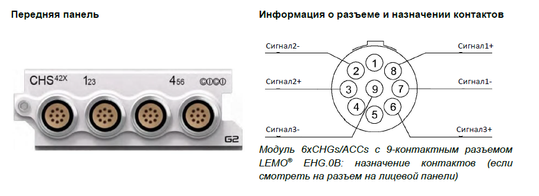
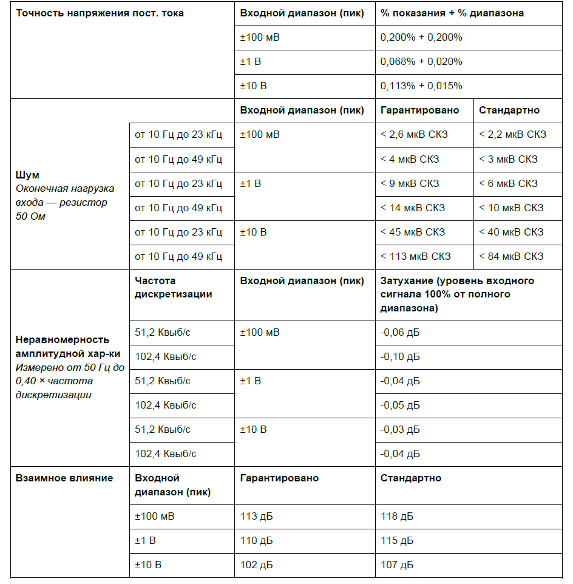
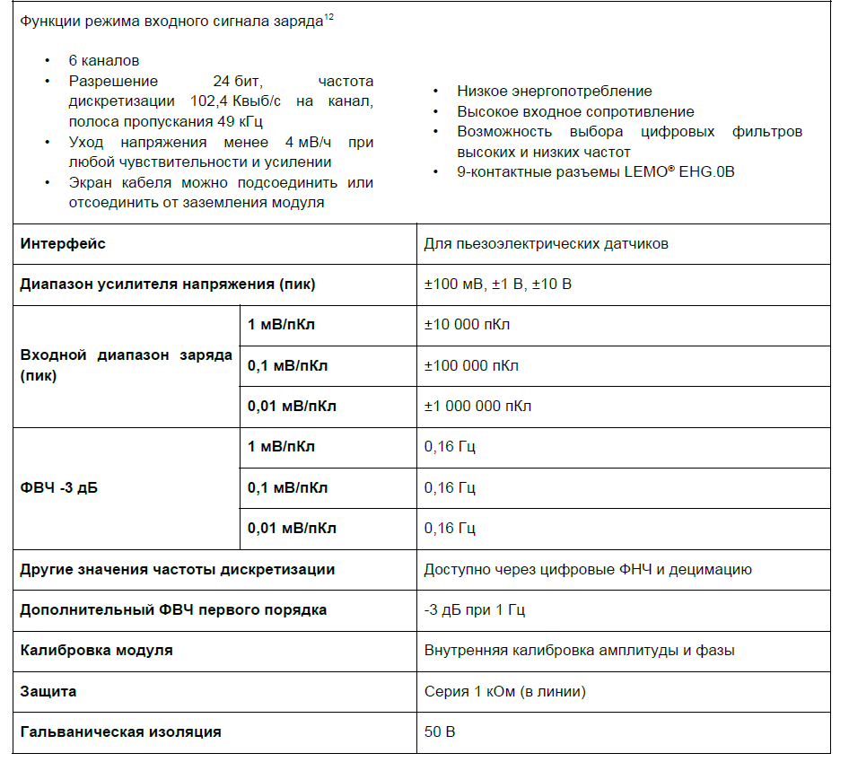
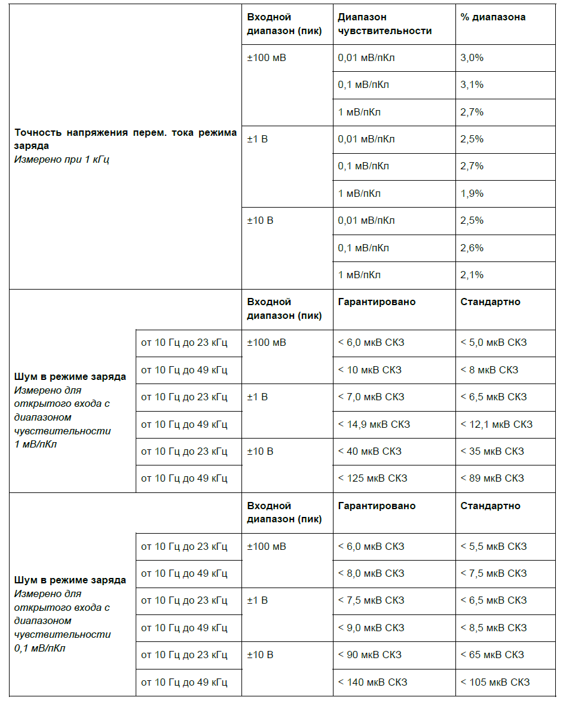
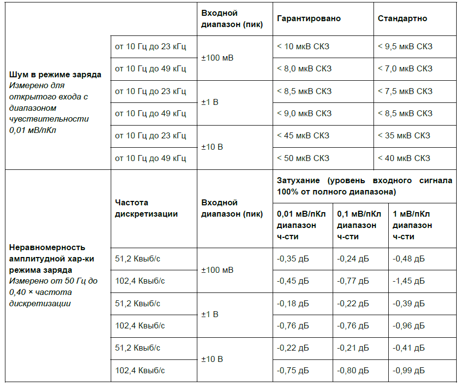
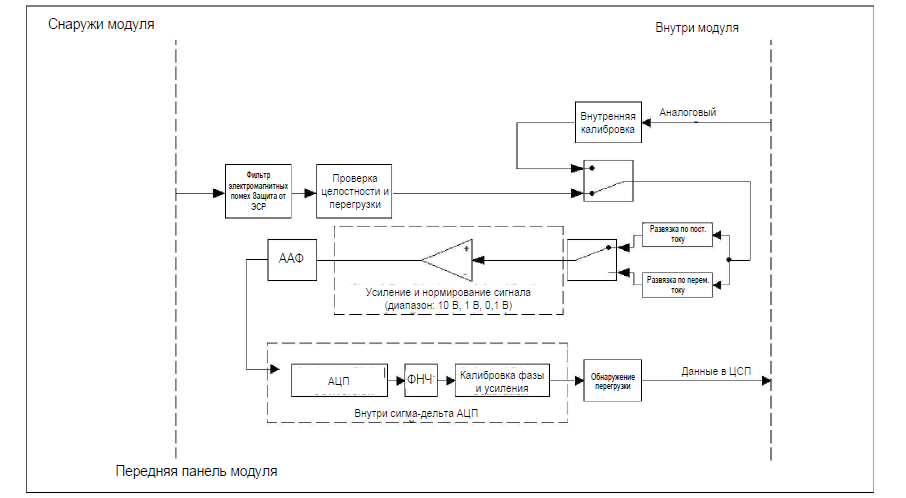

### **Описание**

Модуль 6xCHGs/ACCs можно использовать с ICP®-акселерометрами, датчиками силы и давления, кварцевыми и пьезокерамическими датчиками, а также для измерения аналоговых сигналов напряжения. Модуль можно использовать в двух режимах:

·        режим 6xCHGs -- 6 каналов измерения зарядовых сигналов,

·        режим 6xACCs – 6 каналов измерения напряжения до ±10 В и сигналов ICP® датчиков:

{width=909px height=331px}

### **ПРЕДУПРЕЖДЕНИЕ ОБ ЭЛЕКТРОСТАТИЧЕСКИХ РАЗРЯДАХ**

Входы модуля 6xCHGs/ACCs чувствительны к электростатическим разрядам. Прежде чем подключать кабель или разъем к модулю 6xCHGs/ACCs, принимайте меры по снятию статического электричества, которое может на них накапливаться.

### **Функции режима 6xACCs (входной сигнал напряжения и ICP**®**)**

<image src="./modul-6xchgs-accs-chs42x-2.png" crop="0,0,100,100" scale="100" width="957px" height="966px"/>

##### *Функции режима 6xACCs (входной сигнал напряжения и ICP*®*) модуля  6xCHGs/ACCs*

### **Характеристики режима 6xACCs (входной сигнал напряжения и ICP®)**

<image src="./modul-6xchgs-accs-chs42x-3.png" crop="0,0,100,100" scale="100" width="950px" height="1099px"/>

{width=944px height=962px}

##### *Характеристики режима 6xACCs (входной сигнал напряжения и ICP*®*) модуля  6xCHGs/ACCs.*

### **Функции режима 6xCHGs (входной сигнал заряд)**

{width=946px height=849px}

##### *Функции режима 6xCHGs (входной сигнал заряд) модуля 6xCHGs/ACCs.*

### **Характеристики режима режима 6xCHGs (входной сигнал заряд)**

<image src="./modul-6xchgs-accs-chs42x-6.png" crop="0,0,100,100" scale="100" width="946px" height="989px"/>

{width=947px height=1175px}

{width=949px height=788px}

##### *Характеристики режима 6xCHGs (входной сигнал заряд) модуля 6xCHGs/ACCs.*

### **Функциональная схема на канал**

{width=906px height=498px}

##### *Режим ICP*® *модуля 6xCHGs/ACCs (на канал).*

{width=889px height=499px}

##### *Режим заряда модуля 6xCHGs/ACCs (на канал).*

### **Схема разъемов**

На передней панели модуля *6xCHGs/ACCs* нанесена схема разъемов.

<image src="./modul-6xchgs-accs-chs42x-11.png" crop="0,0,100,100" scale="51" width="356px" height="84px"/>

*Схема разъемов 6xCHGs/ACCs*

{width=946px height=70px}

### **Схема подключения для разъемов ICP**®**\-акселерометров**

*6xCHGs/ACCs* поддерживает входные сигналы от одно- и трехосевых акселерометров ICP®. Конфигурация разъемов на передней панели обеспечивает удобное подключение к двум трехосевым датчикам на модуль. На схеме назначения контактов 9-контактного разъема LEMO® EHG.0B показаны контакты для подключения сигнала по каждой оси X, Y и Z и общего выхода трехосевого датчика.

{width=929px height=394px}

##### *Схема разъемов на передней панели модуля 6xCHGs/ACCs с двумя трехосевыми ICP*®*\-акселерометрами.*

**Варианты заземления: режим измерения входного напряжения**

Для модуля 6xCHGs/ACCs предусмотрено четыре варианта заземления режима ALI:

•           Дифференциальное смещение (балансируемое смещение):

\-        Оба входа подключены по линии 1 МОм к плавающему заземлению.

•           Дифференциальное заземление (балансируемое заземление):

\-        Оба входа подключены по линии 1 МОм напрямую к заземлению.

•           Несимметричное смещение (небалансируемое смещение):

\-        Один вход подключен по линии 1 МОм к плавающему заземлению, а другой -- напрямую к плавающему заземлению.

•           Несимметричное заземление (небалансируемое заземление):

\-        Один вход подключен по линии 1 МОм к плавающему заземлению, а другой -- напрямую к заземлению.

### **Схемы заземления: режим ALI (режим входного напряжения)**

<image src="./modul-6xchgs-accs-chs42x-14.png" crop="0,0,100,100" scale="94" width="577px" height="292px"/>

##### *Модуль 6xCHGs/ACCs в режиме измерения напряжения с дифференциальным смещением (на канал).*

<image src="./modul-6xchgs-accs-chs42x-15.png" crop="0,0,100,100" scale="95" width="568px" height="298px"/>

##### *Модуль 6xCHGs/ACCs в режиме измерения напряжения с несимметричным смещением (на канал).*

<image src="./modul-6xchgs-accs-chs42x-16.png" crop="0,0,100,100" scale="96" width="580px" height="296px"/>

##### *Модуль 6xCHGs/ACCs в режиме измерения напряжения с дифференциальным заземлением (влияет на весь модуль).*

<image src="./modul-6xchgs-accs-chs42x-17.png" crop="0,0,100,100" scale="95" width="574px" height="303px"/>

##### *Модуль 6xCHGs/ACCs в режиме измерения напряжения с несимметричным заземлением (влияет на весь модуль).*

Для каждого канала модуля 6xCHGs/ACCs тип заземления можно настроить отдельно, однако при выборе варианта заземления на любом одном канале изолирующий барьер модуля в переходит режим моста (т.е. AGNDM всех 6 каналов будут напрямую подключены к CGND).

<image src="./modul-6xchgs-accs-chs42x-18.png" crop="0,0,100,100" scale="80" width="572px" height="716px"/>

##### *Настройка заземления 6xCHGs/ACCs влияет на все 6 каналов.*

### **Варианты заземления: режим заряда**

Для модуля 6xCHGs/ACCs предусмотрено 4 варианта заземления. Они служат для снижения электромагнитных помех, которые могут присутствовать в кабелях датчиков.

| **Модуль**  | **Экран кабеля подсоединен** | **Тип**        | **Экран-корпус** |
|-------------|------------------------------|----------------|------------------|
| \*Плавающее | \*Нет                        | Плавающее      | 1 МОм + 10 кОм   |
| Плавающее   | Да                           | \-             | 10 кОм           |
| Заземлено   | Нет                          | \-             | 1 МОм            |
| Заземлено   | Да                           | Несимметричное | \< 20 Ом         |

*Варианты заземления режима заряда модуля  6xCHGs/ACCs*

\* Значение по умолчанию при запуске модуля. Эта комбинация обеспечивает путь для медленного снятия электростатического разряда, а также некоторую защиту от быстрых разрядов, которые могут повредить чувствительные входы сигнала заряда.

### **Схемы заземления: режим заряда**

<image src="./modul-6xchgs-accs-chs42x-19.png" crop="0,0,100,100" scale="94" width="584px" height="318px"/>

##### *Схема заземления 6xCHGs/ACCs: плавающее заземление модуля, экран кабеля отсоединен.*

<image src="./modul-6xchgs-accs-chs42x-20.png" crop="0,0,100,100" scale="93" width="563px" height="317px"/>

##### *Схема заземления 6xCHGs/ACCs: плавающее заземление модуля, экран кабеля подсоединен.*

<image src="./modul-6xchgs-accs-chs42x-21.png" crop="0,0,100,100" scale="93" width="569px" height="316px"/>

##### *Схема заземления 6xCHGs/ACCs: модуль заземлен, экран кабеля отсоединен.*

### **Схемы возбуждения: режим ICP**®

Модуль 6xCHGs/ACCs поддерживает входной режим ICP® с возбуждением током 4 мА. Настройки смещения не зависят от вариантов заземления. В таблице ниже приведены различные возможные настройки модуля в режиме входа ICP®:

| **Напряжение возбуждения** | **Параметры смещения**              | **Варианты заземления**             |
|----------------------------|-------------------------------------|-------------------------------------|
| 24 В (асимметричное)       | Дифференциальное или несимметричное | Заземление или плавающее заземление |

*Настройки модуля 6xCHGs/ACCs в режиме входа ICP*® *с возбуждением током 4 мА*

<image src="./modul-6xchgs-accs-chs42x-22.png" crop="0,0,100,100" scale="88" width="550px" height="295px"/>

##### *Модуль 6xCHGs/ACCs в режиме ICP*® *с возбуждением током 4 мА, выбрано возбуждение 24 В, дифференциальное смещение и плавающее заземление.*

<image src="./modul-6xchgs-accs-chs42x-23.png" crop="0,0,100,100" scale="91" width="553px" height="307px"/>

##### *Модуль 6xCHGs/ACCs в режиме ICP*® *с возбуждением током 4 мА, выбрано возбуждение 24 В, несимметричное смещение и плавающее заземление.*

<image src="./modul-6xchgs-accs-chs42x-24.png" crop="0,0,100,100" scale="92" width="544px" height="303px"/>

##### *Модуль 6xCHGs/ACCs в режиме ICP*® *с возбуждением током 4 мА, выбрано возбуждение 24 В, несимметричное смещение и плавающее заземление.*

<image src="./modul-6xchgs-accs-chs42x-25.png" crop="0,0,100,100" scale="95" width="538px" height="314px"/>

##### *Модуль 6xCHGs/ACCs в режиме ICP*® *с возбуждением током 4 мА, выбрано возбуждение 24 В, несимметричное смещение и заземление.*

