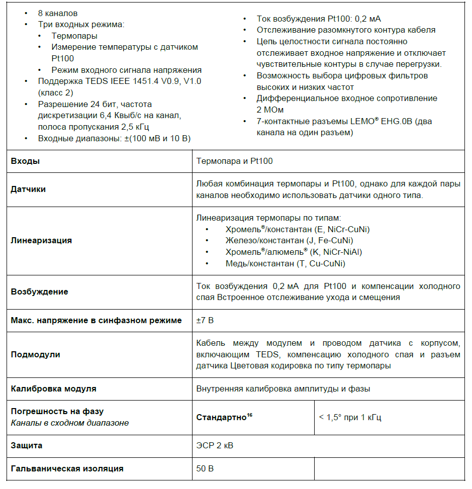
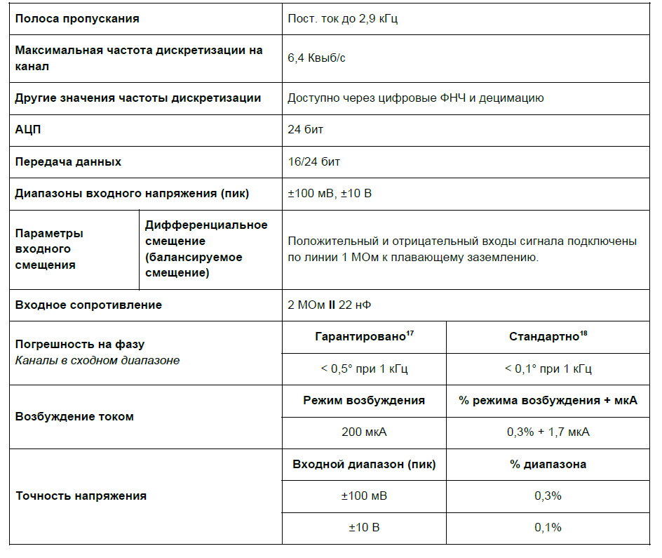
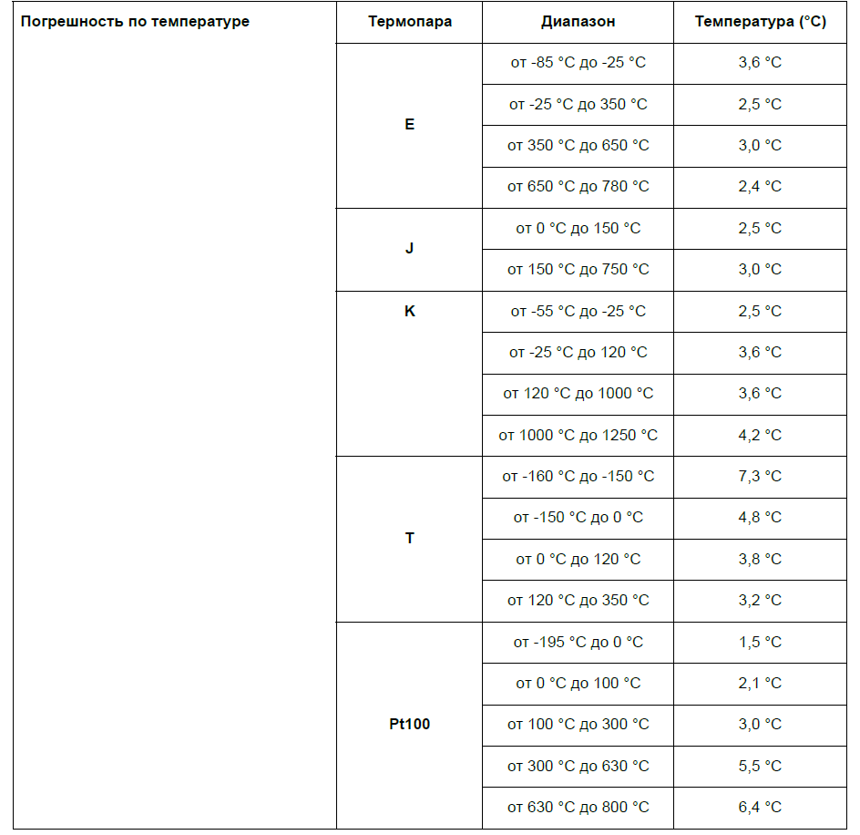
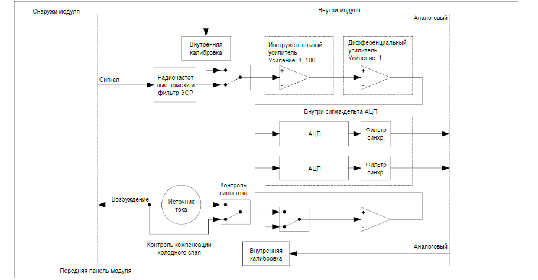

### **Описание**

Модуль 8xTHV включает 8 каналов для подключения любых типов термопар, а также датчиков типа Pt100. Дистанционная компенсация холодного спая обеспечивается подмодулем (который зависит от типа термопары), а линеаризация -- платой нормирования сигнала. Модуль также оснащен откалиброванным источником тока 0,2 мА для возбуждения датчика Pt100.

Используемые с модулем адаптеры содержат пару распространенных мини-разъемов термопар E, J, K и T (другие типы доступны по запросу) со схемой компенсации холодного спая. Еще один адаптер оснащен парой разъемов LEMO® для датчиков Pt100. К модулю 8xTHV можно подключить любую комбинацию соответствующих адаптеров.

Модуль 8xTHV также оснащен 8 каналами для измерения входных сигналов напряжения до ±10 В. Модуль можно использовать:

•           для измерений с термопарами E, J, K и T (другие типы доступны по запросу)

•           при использовании датчиков Pt100 в режиме постоянного тока

•           с любым источником напряжения до ±10 В в режиме ввода напряжения

{width=915px height=376px}

### **Функции**

{width=939px height=973px}

### **Характеристики**

{width=944px height=795px}

{width=944px height=916px}

<image src="./modul-8xthv-thm42-5.png" crop="0,0,100,100" scale="100" width="937px" height="536px"/>

### **Функциональная схема на канал**

{width=910px height=475px}

##### *Обзор функций одного канала 8xTHV.*

