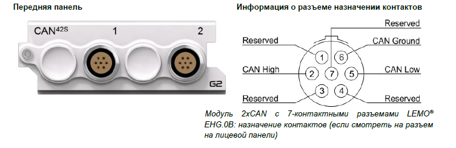
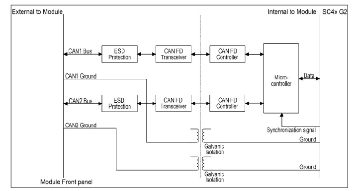
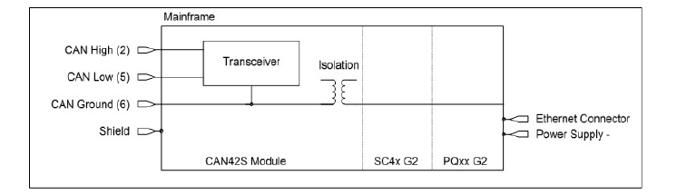

Модуль 2xCAN обеспечивает интерфейсы для двух шин CAN или CAN FD (CAN с гибкой скоростью передачи данных). CAN FD является расширением исходного протокола CAN (Controller Area Network), что обеспечивает более высокую пропускную способность данных.

Сообщения, полученные от CAN, имеют временную метку для синхронизации их приема с аналоговыми и цифровыми измерениями от других модулей в системе. Обеспечивается самостоятельный прием отправленных сообщений, а также три режима работы, включая режим участия, режим только прослушивания, самостоятельный прием отправленных сообщений и режим обратной связи.

Модуль 2xCAN имеет независимую фильтрацию каналов и может использоваться:

·        При мониторинге сообщений на основе CAN и CAN FD

·        При управлении устройствами на основе CAN и CAN FD.

{width=753px height=244px}

##### Примечание. Контакт 6 – канал заземления CAN 1 и канал заземления CAN 2 изолированы друг от друга.

### **Особенности**

·        Соответствует ISO 11898-1:2015 («ISO CAN FD»)

·        Поддерживает арбитражные скорости передачи данных от 14,4 кбит/с до 1000 кбит/с

·        Поддерживает скорости передачи данных от 14,4 кбит/с до 8000 кбит/с (только один канал) или 2000 кбит/с (оба канала одновременно)

·        Поддерживает конфигурацию точки выборки для фазы арбитража

·        Программно выбираемое окончание шины 120 Ом на канал

·        3 режима работы:

·       Участвовать -- активно подтверждает сообщения на шине и отправляет сообщения

·       Только прослушивать -- пассивно интерпретирует сообщения, отправляемые между другими узлами на шине

·       Обратная петля -- формирует внутреннюю виртуальную шину, которая получает только свои собственные отправленные сообщения

·        Каждое сообщение CAN, полученное и принятое модулем, имеет временную метку в порядке для синхронизации полученных сообщений CAN с остальными данными измерений

·        Индивидуально настраиваемый список идентификаторов на канал для обеспечения фильтрации приема всех сообщений CAN, полученных с шины CAN

·        Индивидуально настраиваемая передача сообщений CAN

·        Каждый канал имеет защиту от электростатического разряда и других вредных переходных процессов

·        LEMO® 7-контактные разъемы EHG.0B

·        9-контактные разъемы D-sub поставляются с подмодулем CANC10.

### **Функциональная схема канала**

{width=722px height=385px}

##### *Функциональная схема модуля 2xCAN на канал.*

Модуль CAN содержит два канала, которые реализованы его прошивкой для работы в качестве входов или выходов (канал 1 – вход/выход 1; канал 2 – вход/выход 2).

*2xCAN* соответствует ISO 11898-1:2015 и CAN 2.0 B (с поддержкой 11-битных и 29-битных идентификаторов).

Отметка времени выполняется для каждого полученного сообщения, что позволяет синхронизировать сообщения CAN с остальными данными измерений.

### **Схема заземления**

{width=746px height=215px}

##### *Заземление модуля 2xCAN на канал.*

