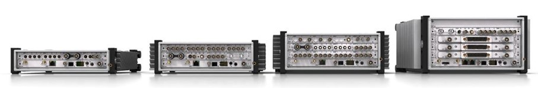

Приборы ORION-Rx представляют собой многоканальную системы сбора данных для измерения электрических и физических величин. В корпусе приборов ORION-Rx может размещаться до 120 каналов. Каждая система ORION-Rx поддерживает безопасное подключение, обмен данными и управление с помощью пользовательского интерфейса, ноутбука или смартфона, а также может сохранять данные для последующего воспроизведения.

Для использования систем типичный пользователь должен понимать принципы измерительных цепей и анализа сигналов.

{width=907px height=149px}