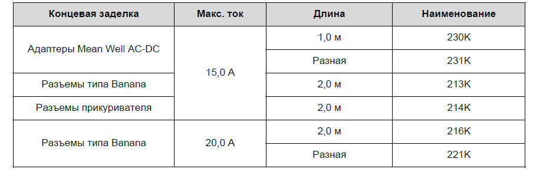
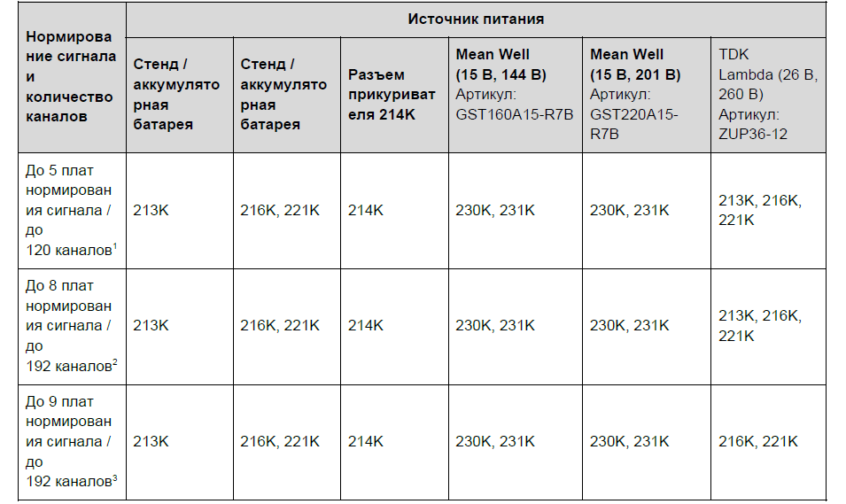
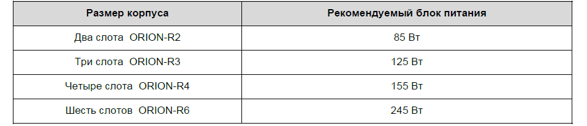
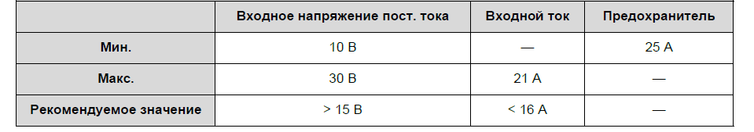

### **Питание ORION-Rx**

В системах ORION-Rx используются специализированные кабели питания для обеспечения оптимальной работы. Использовать кабели сторонних производителей крайне нежелательно, так как это может привести к повреждению системы. Обратитесь к своему поставщику для получения дополнительной информацией о том, какой кабель лучше всего подойдет для конфигурации вашей измерительной системы.

Системы ORION-Rx работают в диапазоне напряжения 10–30 В пост. тока. При работе приборов ORION-Rx с более низким напряжением кабели и разъемы питания могут нагреться из-за возникающего повышенного тока. При пониженном напряжении питания увеличивается ток, протекающий через сопротивление кабеля и разъема, что приводит к квадратичному росту температуры.

Следовательно, для обеспечения питания крупных систем ORION-Rx рекомендуется:

·          Использовать короткие кабели;

·          Увеличить напряжение (например, 24 В вместо 12 В);

·          Не добавлять промежуточные разъемы или соединения на кабель питания.

При выключении системы проверьте, что питание отключается с помощью веб-сервера или кнопок пользовательского интерфейса на передней панели корпуса. Выключение системы простым отсоединением блока питания может привести к необратимому повреждению оборудования.

Кроме того, отключать блок питания, если в нем отсутствует аккумуляторная батарея, запрещено. Аккумуляторная батарея обеспечивает защиту оборудования и (или) записанных данных в случае отключения блока питания системы. При необходимости выключить систему, работающую только от аккумуляторной батареи, используйте веб-сервер или кнопки пользовательского интерфейса.

| **Предупреждение**                                                                                                                                                                                                                                                                                                                    |
|---------------------------------------------------------------------------------------------------------------------------------------------------------------------------------------------------------------------------------------------------------------------------------------------------------------------------------------|
| Запрещено выключать и перезагружать систему ORION-Rx во время ее загрузки или обновления прошивки. Это может привести к необратимому повреждению системы. Чтобы продолжить работу с системой, дождитесь, пока на дисплее появится надпись **Idle (ждущий режим)**, **live (запущен PAK live)**, **REC (запись)** или **FAIL (сбой)**. |

### **Доступные кабели питания**

В таблице ниже приведена информация, с помощью которой можно выбрать подходящий кабель для подключения внешнего источника питания:

{width=921px height=288px}

### **Предлагаемые кабели питания для различных конфигураций системы**

{width=955px height=569px}

### **Требуемое питание**

Рекомендуемая мощность блока питания зависит от размера корпуса ORION-Rx. В таблице ниже приведена рекомендуемая мощность блока питания для всех размеров корпусов ORION-Rx:

{width=958px height=207px}

При наличии большого количества каналов (стандартно для конфигураций корпусов ORION-Rx на шесть слотов) или при использовании функции динамической зарядки рекомендуется применять следующие значения входного напряжения:

{width=959px height=169px}

### Источник бесперебойного питания (ИБП) и аккумуляторные батареи ORION-Rx

Все системы ORION-Rx оснащены внутренним блоком аккумуляторов. В случае падения входного напряжения питания прибора ORION-Rx ниже порогового значения (стандартно 8,5–9,6 В в зависимости от используемой технологии) питание системы ORION-Rx осуществляется от ИБП с помощью блока аккумуляторов.

При работе прибора ORION-Rx от блока аккумуляторов дольше 4 секунд на дисплее пользовательского интерфейса появится сообщение **BACKUP** или **BKP (резервный источник питания)**. Когда входное напряжение системы поднимется выше порогового значения, ИБП автоматически переключится обратно на основной источник питания ORION-Rx.

Приборы ORION-Rxработают при заданной температуре блока аккумуляторов от -20 до 65 °C, хотя при низких температурах емкость аккумуляторов снижается. Защита на случай питания ORION-Rxот блока аккумуляторов при температуре ниже -20 °C не предусмотрена.

### **Техническое обслуживание аккумуляторных батарей**

### **Зарядка аккумуляторной батареи**

Аккумуляторную батарею ORION-Rx можно зарядить тремя способами:

·          **FCH -- Быстрая зарядка**

Быстрая зарядка возможна только после выключения прибора ORION-Rx. Длительность зарядки зависит от размера корпуса: прибор DECA**Q** с двумя слотами заряжается за 2 часа (самая короткая зарядка), а прибор ORION-Rx с десятью слотами заряжается за 3 часа (самая продолжительная зарядка).

·          **SCH -- Медленная зарядка**

Медленная зарядка аккумуляторной батареи возможна как для включенного, так и для выключенного прибора ORION-Rx. Для медленной зарядки полностью разряженной аккумуляторной батареи прибора ORION-Rx с десятью слотами требуется около 16 часов.

·          **DCH -- Динамическая зарядка**

С помощью этой настройки можно максимально быстро зарядить аккумуляторную батарею включенного прибора ORION-Rx. При динамической зарядке в аккумуляторную батарею перенаправляется вся доступная мощность, не используемая системой.

##### *Разные режимы зарядки нельзя использовать одновременно.*

Чтобы обеспечить резервное питание системы ORION-Rx от ИБП, аккумуляторная батарея должна быть заряжена. Для зарядки разряженной аккумуляторной батареи можно использовать любую из трех настроек. Необходимый вариант можно выбрать в пользовательском интерфейсе

Наиболее эффективным способом поддержания заряда аккумуляторной батареи является новая настройка «Динамическая зарядка». Динамическая зарядка поддерживает полный заряд аккумуляторной батареи в автоматическом режиме.

Для полной зарядки разряженной аккумуляторной батареи можно также использовать режимы «Медленная зарядка» и «Быстрая зарядка». Рекомендуется полностью разряжать и заряжать аккумуляторную батарею ORION-Rx хотя бы раз в 6 месяцев (с помощью режима медленной или быстрой зарядки).

### **Примечание**

·          При отключении внешнего источника питания во время зарядки прибор ORION-Rx переходит в режим резервного питания от аккумуляторной батареи.

·          Из-за свойств никель-кадмиевых и никель-металлогидридных аккумуляторных батарей заряжать их можно только при температуре от 10 до 45 °C. В случае превышения значения 45 °C на дисплее пользовательского интерфейса отобразится сообщение **BHOT** и зарядка будет прекращена

·          **BHOT,** Сообщение **BHOT** отображается на дисплее пользовательского интерфейса в случае перегрева блока аккумуляторов (≥ 65 °C) или превышения 45 °C во время зарядки. В обоих случаях система прекратит зарядку аккумуляторной батареи:

--  45 °C, Во время зарядки температура, при которой блок аккумуляторов считается горячим, составляет 45 °C. Это обусловлено безопасностью, так как блок аккумуляторов лучше заряжать при более низких температурах.

--  65 °C, Когда блок аккумуляторов не заряжается, температура, при которой он считается горячим, составляет 65 °C.