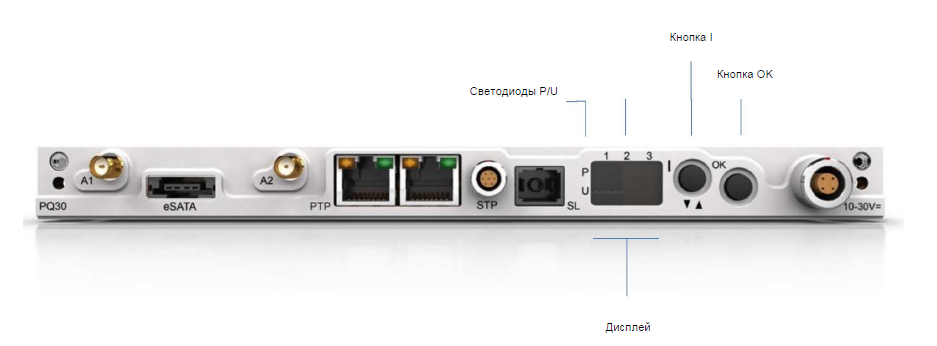{width=937px height=346px}

С помощью пользовательского интерфейса ORION-Rx можно получать информацию о конкретной системе и выполнять определенные значимые команды. Интерфейс расположен на системной плате прибора и включает дисплей на четыре символа, пять светодиодов (светодиоды 1,2,3 и светодиоды P и U) и две кнопки (кнопка **I** и кнопка **OK**).

Для управления пользовательским интерфейсом нажмите кнопку **I**, чтобы прокручивать пункты меню, которые отображаются на дисплее. Нажмите кнопку **OK**, чтобы выбрать пункт меню и выполнить соответствующую команду. В целях безопасности на дисплее может появиться надпись **SURE (подтвердить)**, чтобы подтвердить команду до ее выполнения системой.

Чтобы увеличить яркость дисплея, зажмите кнопку **OK**: дисплей будет менять разные уровни яркости. Дойдя до нужного уровня яркости, отпустите кнопку **OK**.

### **Примечание**

Запрещено выключать и сбрасывать прибор ORION-Rx во время загрузки или обновления прошивки, так как это может привести к необратимому повреждению системы. Перед выполнением команд дождитесь, пока на дисплее пользовательского интерфейса появится надпись Idle (ждущий режим), live (запущен PAK live), Rec (запись) или FAIL (сбой).

### **Пункты меню пользовательского интерфейса, когда прибор ORION-Rx выключен**

В таблице ниже представлены доступные пункты меню выключенного прибора ORION-Rx:

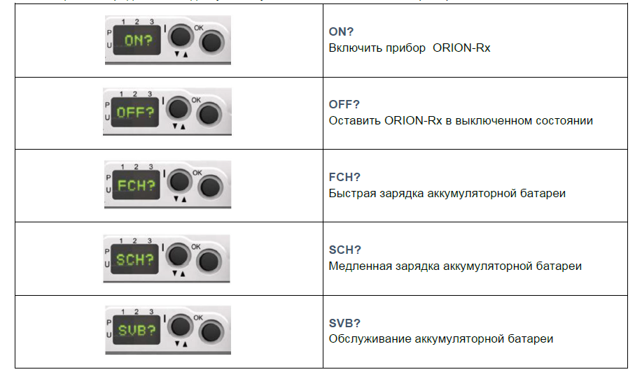{width=917px height=532px}

##### *Пункты меню будут повторяться заново, если продолжить нажимать кнопку **I** (т.е. после **SVB?** появится **ON?**).*

### **Быстрая зарядка (FCH?)**

{width=1940px height=236px}

Для быстрой зарядки (**FCH?**) дополнительно требуется электрическая входная мощность около 60 Вт. Если блок питания не обеспечит дополнительную мощность, система может сброситься. Быструю зарядку можно выполнять только до загрузки системы. При использовании этого способа зарядки система также нагревается. Следовательно, настоятельно рекомендуется выполнять быструю зарядку в помещении, где есть свободный поток холодного воздуха.

Для защиты системы от перегрева прибор ORION-Rx должен быть выключен во время быстрой зарядки аккумуляторной батареи.

Порядок быстрой зарядки аккумуляторной батареи (прибор ORION-Rx выключен):

·          Убедитесь, что система ORION-Rx выключена;

·          Нажмите кнопку **I** для включения питания;

·          Когда на дисплее появится надпись **ON?**, несколько раз нажмите кнопку **I** и прокрутите меню до **FCH?** или **SCH?**;

·          Нажмите кнопку **OK**, чтобы подтвердить **FCH?**; На дисплее появится надпись **SURE** (для подтверждения). Снова нажмите кнопку **OK**, чтобы подтвердить команду;

·          Зарядка начнется в течение 5 минут. После начала зарядки последовательно загорятся светодиоды 3, 2, 1 (при медленной зарядке последовательность выполняется медленнее).

### **Медленная зарядка (прибор ORION-Rx выключен)**

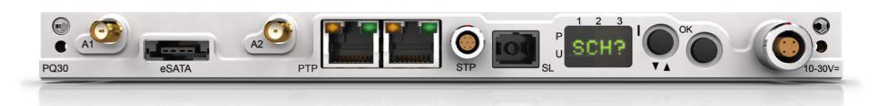{width=1960px height=236px}

Для медленной зарядки (**SCH?**) требуется электрическая входная мощность около 10 Вт. При медленной зарядке аккумуляторных батарей система ORION-Rx может быть включена и не будет перегреваться, так как медленная зарядка создает лишь небольшую дополнительную нагрузку на блок питания. Однако полная зарядка аккумуляторной батареи при этой настройке займет до 16 часов.

Ниже приведен порядок медленной зарядки ORION-Rx, когда система **не используется**:

·          Убедитесь, что система ORION-Rx выключена;

·          Нажмите кнопку **I** для включения питания;

·          Когда на дисплее появится надпись **ON?**, несколько раз нажмите кнопку **I** и прокрутите меню до **FCH?** или **SCH?**;

·          Нажмите кнопку **OK**, чтобы подтвердить **SCH?**; На дисплее появится надпись **SURE** (для подтверждения). Снова нажмите кнопку **OK**, чтобы подтвердить команду;

Зарядка начнется в течение 5 минут. После начала зарядки последовательно загорятся светодиоды 3, 2, 1 (при быстрой зарядке последовательность выполняется быстрее).

### **Обслуживание аккумуляторной батареи (SVB)**

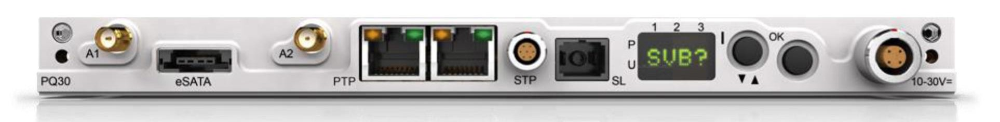{width=1926px height=236px}

В режиме **SVB?** (обслуживание аккумуляторной батареи) аккумулятор полностью разряжается, после чего автоматически начинается цикл медленной зарядки. Процесс можно завершить в любой момент цикла **SVB?**, выбрав **ESB?** (завершить обслуживание аккумуляторной батареи?).

Для оптимального обслуживания аккумуляторные батареи ORION-Rx необходимо разряжать и полностью заряжать хотя бы раз в полгода. Это позволяет поддерживать максимальную энергоемкость аккумуляторов.

### **Пункты меню пользовательского интерфейса, когда прибор DECAQ включен**

После включения прибора ORION-Rx на дисплее пользовательского интерфейса будут доступны следующие пункты меню (прокрутите их с помощью кнопки **I** до нужного):

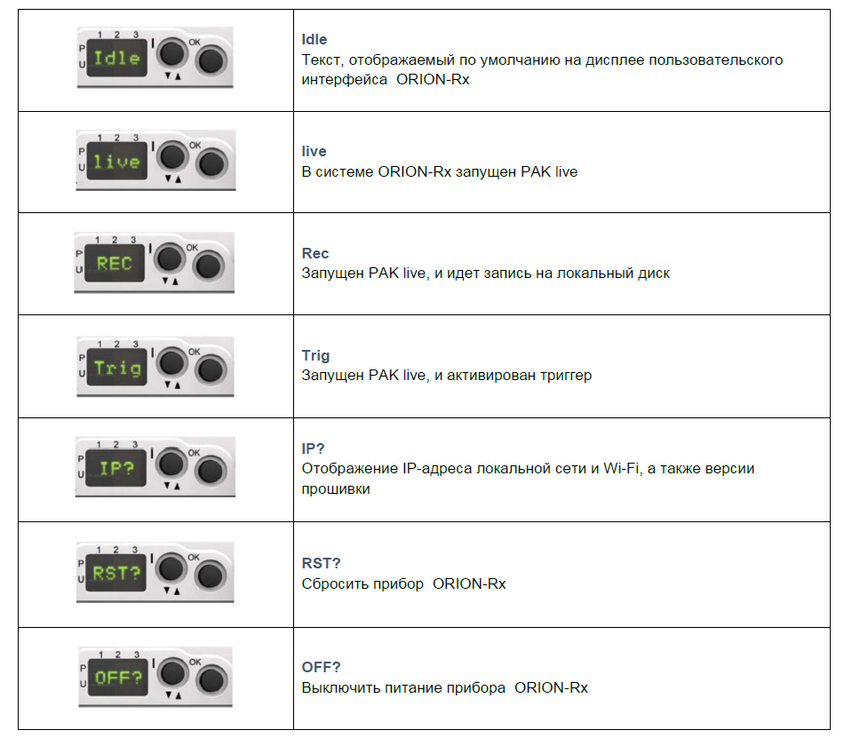{width=959px height=831px}

<image src="./navigaciya-po-polzovatelskomu-interfeysu-orion-rx-7.png" crop="0,0,100,100" scale="100" width="746px" height="800px"/>

Пункты меню пользовательского интерфейса циклично повторяются: нажмите кнопку **I**, чтобы перейти от **DFLT** к **IP?** и т.д.

### **IP-адрес (IP?)**

Порядок отображения IP-адреса на дисплее пользовательского интерфейса:

·      Прокрутите пункты меню с помощью кнопки **I** до появления надписи **IP?**;

·      Нажмите кнопку **OK**, чтобы выбрать этот пункт меню. На дисплее появится надпись **SURE (подтвердить)**;

·      Снова нажмите кнопку **OK**, чтобы подтвердить команду;

·      На дисплее появится надпись **OK**, а затем четыре части IP-адреса, например **192\., 168., 1.,** и **231\.**, т.е. полный IP-адрес будет **192\.168.1.231.**

·      Если установлена плата WLAN, то ее IP-адрес также будет показан перед отображением версий прошивки;

·      После IP-адреса в пользовательском интерфейсе будет показана прочая информация о версиях прошивки контроллера и блока нормирования сигнала, используемых в системе ORION-Rx:

·      Номер версии прошивки контроллера (например, **1 - 4 - a**);

·      Информация о версии прошивки контроллера (например, **13582605**);

·      Номер версии прошивки блока нормирования сигнала (например, **1 - 4 - a**);

·      Информация о версии прошивки блока нормирования сигнала (например, **16230809**).

### **Сброс системы (RST?)**

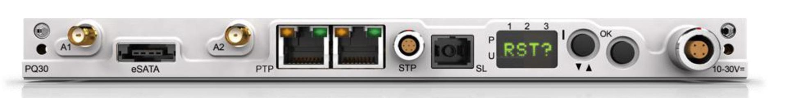{width=1922px height=241px}

Порядок сброса прибора ORION-Rx:

·          Прокрутите пункты меню с помощью кнопки **I** до появления надписи **RST?**;

·          Нажмите кнопку **OK**, чтобы выбрать этот пункт меню. На дисплее появится надпись **SURE (подтвердить)**;

·          Снова нажмите кнопку **OK**, чтобы подтвердить команду;

·          На дисплее появится надпись **OK**, а затем **Boot (загрузка)**.

### **Примечание**

При таком сбросе системы все выполняемые в данный момент операции будут прекращены. Соответственно, сброс прибора ORION-Rx будет выполнен независимо от того, проводятся ли сейчас испытания, что повышает риск потери ценных данных.

### **Выключение прибора DECAQ (OFF?)**

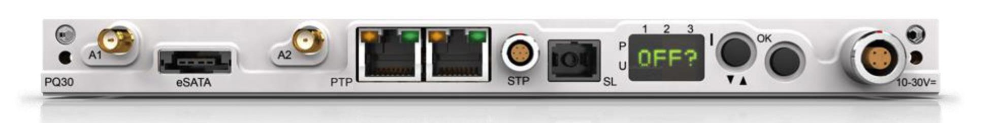{width=1967px height=242px}

##### <color color="red">*Информация приведена в разделе 6.2.2. «Выключение».*</color>

### **Информация об аккумуляторной батарее (BAT?)**

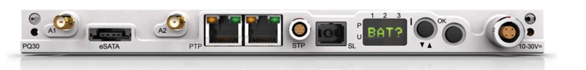{width=1981px height=239px}

В этом пункте меню отображается информация о состоянии аккумуляторной батареи ORION-Rx:

·          Прокрутите пункты меню с помощью кнопки **I** до появления надписи **BAT?**;

·          Нажмите кнопку **OK**, чтобы выбрать этот пункт меню. На дисплее появится надпись **SURE (подтвердить)**;

·          Снова нажмите кнопку **OK**, чтобы подтвердить команду;

·          На дисплее появится надпись **OK**, а затем **Wait (ожидание)** и **BON (аккумулятор включен)**. Питание системы будет осуществляться от аккумуляторной батареи с измерением ее напряжения;

·          На дисплее отобразится текущее напряжение аккумуляторной батареи, например **15\.1**;

·          Появится комментарий по состоянию аккумуляторной батареи (в зависимости от напряжения), например **BOk+** (см. ниже);

·          Затем отобразится температура аккумуляторной батареи в градусах Цельсия, например **\+26C**.

В системе DECA**Q** с двумя слотами (с аккумулятором на восемь ячеек) доступны следующие уровни напряжения:

·          **BFUL** (> 10 В);

·          **BOk+** (9,4–10 В);

·          **BOk-** (8,6–9,4 В);

·          **BLOW** (\< 8,6 В).

В системе ORION-Rx с тремя, четырьмя, шестью и десятью слотами (с аккумулятором на 12 ячеек) доступны следующие уровни напряжения:

·          **BFUL** (> 15,6 В);

·          **BOk+** (13,2–15,6 В);

·          **BOk-** (12,7–13,2 В);

·          **BLOW** (\< 12,7 В).

### **Состояние блока питания (PSU?)**

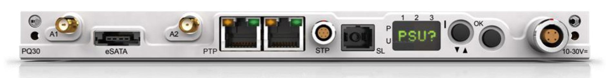{width=1898px height=244px}

Этот пункт меню на дисплее пользовательского интерфейса используется для отображения измеренных уровней электрического напряжения и (или) тока для текущего входа питания ORION-Rx. Кроме того, можно вывести на дисплей информацию о внутренних блоках питания.

Чтобы просмотреть информацию:

·          Прокрутите пункты меню с помощью кнопки **I** до появления надписи **PSU?**;

·          Нажмите кнопку **OK**, чтобы выбрать этот пункт меню. На дисплее появится надпись **SURE (подтвердить)**;

·          Снова нажмите кнопку **OK**, чтобы подтвердить команду;

·          На дисплее появится надпись **OK** и отобразится состояние источника питания.

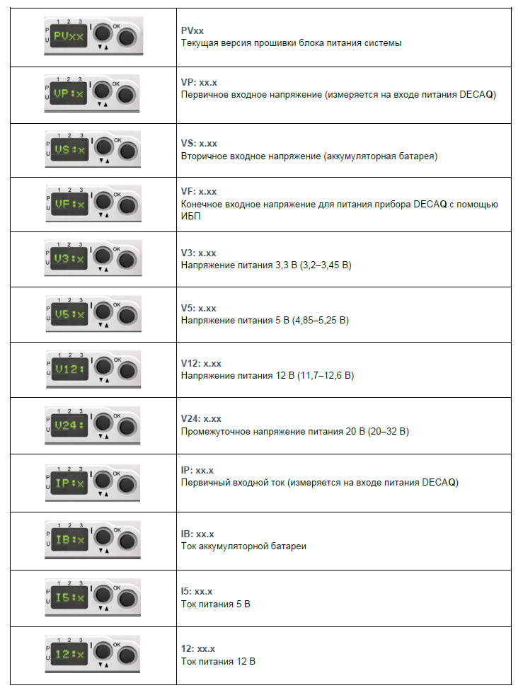{width=739px height=972px}

### **Температура (TMP?)**

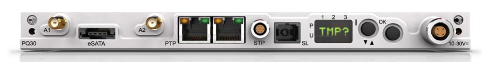{width=1936px height=247px}

Порядок отображения на дисплее температуры корпуса:

·          Прокрутите пункты меню с помощью кнопки **I** до появления надписи **TMP?**;

·          Нажмите кнопку **OK**, чтобы выбрать этот пункт меню. На дисплее появится надпись **SURE (подтвердить)**;

·          Снова нажмите кнопку **OK**, чтобы подтвердить команду;

·          На дисплее появится надпись **OK**, а затем температура корпуса, например **\+40C**.

### **Автоматическое или ручное включение (AOn? / MOn?)**

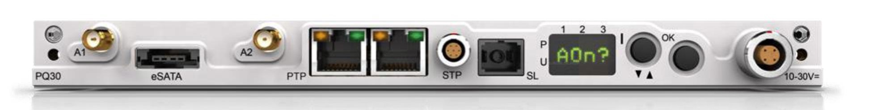{width=2002px height=247px}

**AOn? (автоматическое включение)**

ORION-Rx включается либо вручную с помощью пользовательского интерфейса, либо автоматически, когда система обнаруживает напряжение на разъеме питания. Автоматическое включение нужно, когда из-за расположения прибора ORION-Rx доступ к пользовательскому интерфейсу при проведении измерений затруднен. Для удобства ORION-Rx будет включаться при включении внешнего источника питания системы.

Порядок настройки автоматического включения (**AOn**):

·          Прокрутите пункты меню с помощью кнопки **I** до появления надписи **AOn?**;

·          Нажмите кнопку **OK**, чтобы выбрать этот пункт меню. На дисплее появится надпись **SURE (подтвердить)**;

·          Снова нажмите кнопку **OK**, чтобы подтвердить команду;

·          На дисплее появится надпись **OK**.

С этой настройкой система включится автоматически при подаче питания: на дисплее появится надпись **ON?** и начнется обратный отсчет до 0 с перед полным запуском. Обратный отсчет можно остановить, нажав любую кнопку пользовательского интерфейса. Затем можно обычным способом выбрать функции, доступные перед запуском системы (когда прибор ORION-Rx выключен). Если не нажимать никаких кнопок пользовательского интерфейса, система включится и запустится.

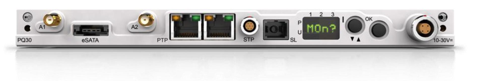{width=1971px height=331px}

### **Ручное включение (MOn?)**

Включение прибора ORION-Rx с помощью пользовательского интерфейса.

Порядок ручного включения (**MOn**):

·          Прокрутите пункты меню с помощью кнопки **I** до появления надписи **MOn?**;

·          Нажмите кнопку **OK**, чтобы выбрать этот пункт меню. На дисплее появится надпись **SURE (подтвердить)**;

·          Снова нажмите кнопку **OK**, чтобы подтвердить команду;

·          На дисплее появится надпись **OK**.

Ручной режим включения установлен для прибора ORION-Rx по умолчанию. С помощью приведенных выше инструкций можно вернуть ручной режим включения системы, если ранее он был изменен в настройках на автоматический.

### **Общая информация о системе (INF?)**

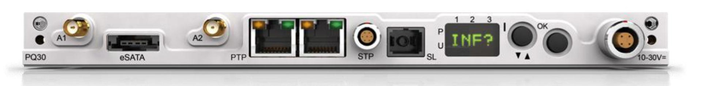{width=1946px height=239px}

Этот пункт меню используется для отображения информации о приборе ORION-Rx, а также версий прошивки.

Порядок отображения информации:

·          Прокрутите пункты меню с помощью кнопки **I** до появления надписи **INF?**;

·          Нажмите кнопку **OK**, чтобы выбрать этот пункт меню. На дисплее появится надпись **SURE (подтвердить)**;

·          Снова нажмите кнопку **OK**, чтобы подтвердить команду;

·          На дисплее появится надпись **OK**, а затем соответствующая информация.

#### **Примеры отображаемой информации:**

Текущая версия прошивки блока питания системной платы:

-  Прошивка блока питания: **PV17**

Информация о версии аппаратного обеспечения системной платы, т.е. название, ревизия и номер сборки печатной платы:

-  Название печатной платы: **PCB PQ30**

-  Ревизия печатной платы: **Rev 06**

-  Сборка печатной платы: **Bld A\*\*\***

Прошивка ИБП, СПЛИС и ПЛИС прибора DECA**Q** не подлежит удаленному обновлению, поэтому на дисплее отображается текущая версия (обратите внимание, что эта информация связана с номером сборки):

-  Прошивка ИБП: **UPS 07** Прошивка

-  СПЛИС: **CPLD 01** Прошивка

-  ПЛИС: **FPGA 01**

Серийный номер PQ (отображается без символа «M» из-за ограниченного размера дисплея):

-  Серийный номер: **SrNo 03129032**

### **Настройка времени работы от резервного источника питания (BTMx)**

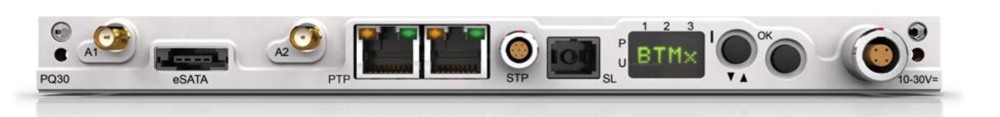{width=1954px height=230px}

При настройке времени работы от резервного источника питания устанавливается время, в течение которого прибор ORION-Rx будет работать от аккумуляторной батареи до отключения. Эта настройка полезна, если прибор нужно выключить до того, как аккумулятор полностью разрядится.

Порядок изменения настройки времени работы от резервного источника питания:

·          Проверьте, что прибор ORION-Rx включен (подается питание);

·          Прокрутите пункты меню с помощью кнопки **I** до появления надписи **BTMx**;

·          Нажмите кнопку **OK**, чтобы выбрать этот пункт меню.

·          Прокрутите пункты меню с помощью кнопки **I** до требуемой настройки (например, **BT02**);

·          Нажмите кнопку **OK**, чтобы выбрать этот пункт меню. На дисплее появится надпись **OK**.

Доступно семь вариантов настройки времени работы от резервного источника питания:

·          **BTimeOff: Off**

 Настройка времени работы от резервного источника питания неактивна. Прибор ORION-Rx будет выключаться сразу же после отключения внешнего источника питания от корпуса.

·          **BT01: 1 min**

 Время работы от резервного источника питания 1 минута. Максимальное время работы от резервной аккумуляторной батареи до выключения прибора составляет 1 минуту.

·          **BT02: 2 min**

 Время работы от резервного источника питания 2 минуты.

·          **BT05: 5 min**

 Время работы от резервного источника питания 5 минут.

·          **BT10: 10 min**

 Время работы от резервного источника питания 10 минут.

·          **BT30: 30 min**

 Время работы от резервного источника питания 30 минут.

·          **BTMx: Max**

 Время работы от резервного источника питания максимально возможное. Прибор ORION-Rx будет работать от резервной аккумуляторной батареи до ее полной разрядки.

### **Примечание**

Функция BTimeOff отключает ИБП системы, после чего использовать блок аккумуляторов в качестве источника питания невозможно.

Для включения системы без внешнего источника питания (с использованием блока аккумуляторов) необходимо выполнить следующие действия:

·          Нажмите кнопку I вниз и удерживайте ее не менее 3 секунд. Дисплей будет пустым, но затем на нем появится надпись RST!;

·          Нажмите кнопку OK, чтобы подтвердить выбор;

Настройка BTimeOff будет сброшена до BTMx.

### **Медленная зарядка (SCH), когда прибор ORION-Rx включен**

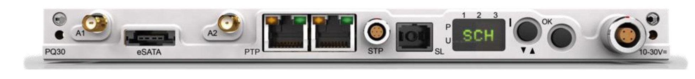{width=1954px height=224px}

Режим медленной зарядки позволяет заряжать аккумуляторную батарею при включенном питании системы. Таким образом, система не перегревается, так как дополнительная нагрузка на блок питания небольшая. Недостатком является то, что для полной зарядки аккумулятора может потребоваться до 16 часов.

Порядок медленной зарядки аккумуляторной батареи, когда прибор ORION-Rx включен:

·          Если прибор ORION-Rx выключен, сперва включите систему <color color="red">*(дополнительная информация приведена в разделе*</color> <color color="red">[*«Включение»*](#bookmark4)*)*</color>, а затем дождитесь ее загрузки (т.е. появления на дисплее пользовательского интерфейса надписи **Idle (ждущий режим)**);

·          Прокрутите пункты меню с помощью кнопки **I** до появления надписи **SCH?**;

·          Нажмите кнопку **OK**, чтобы выбрать этот пункт меню. На дисплее появится надпись **SURE (подтвердить)**;

·          Снова нажмите кнопку **OK**, чтобы подтвердить команду; Зарядка начнется в течение 5 минут;

·          Последовательно загорятся светодиоды 3, 2, 1. При медленной зарядке последовательность выполняется медленно;

·          Продолжите использование системы.

Чтобы завершить медленную зарядку, прокрутите меню с помощью кнопки **I** до появления на дисплее надписи **eSCH**, после чего нажмите кнопку **OK** для выбора этого пункта меню.

### **Динамическая зарядка (DCH)**

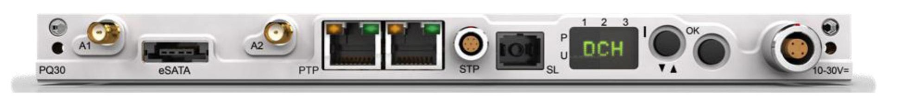{width=1971px height=230px}

Динамическая зарядка позволяет заряжать аккумуляторную батарею во время работы системы. Однако в отличие от медленной зарядки при динамической зарядке ток заряда меняется в зависимости от входного тока системы. Хотя с помощью этого способа аккумулятор можно зарядить быстрее, чем в режиме медленной зарядки, из-за дополнительной электрической входной мощности (до 40 Вт) система сильнее нагревается.

Порядок динамической зарядки аккумуляторной батареи, когда прибор ORION-Rx включен:

·          Если прибор ORION-Rx выключен, сперва включите систему <color color="red">*(дополнительная информация приведена в разделе*</color> <color color="red">[*«Включение»*](#bookmark4)*)*</color>, а затем дождитесь ее загрузки (т.е. появления на дисплее пользовательского интерфейса надписи **Idle (ждущий режим)**);

·          Прокрутите пункты меню с помощью кнопки **I** до появления надписи **DCH?**;

·          Нажмите кнопку **OK**, чтобы выбрать этот пункт меню. На дисплее появится надпись **SURE (подтвердить)**;

·          Снова нажмите кнопку **OK**, чтобы подтвердить команду; Зарядка начнется в течение 5 минут;

·          Последовательно загорятся светодиоды 3, 2, 1. Последовательность динамической зарядки выполняется быстрее, чем в режиме медленной зарядки;

·          Продолжите использование системы.

Чтобы завершить динамическую зарядку, прокрутите меню с помощью кнопки **I** до появления на дисплее надписи **eDCH**, после чего нажмите кнопку **OK** для выбора этого пункта меню.

### **Входные токи и температура системы**

Перед началом динамической зарядки необходимо, чтобы общий входной ток не превышал 15 А. Когда входной ток системы опустится до значения ниже 15 А, зарядка будет запущена. После этого ток заряда аккумуляторной батареи будет увеличиваться до максимального значения или до превышения входного тока 15 А.

Если общий входной ток превысит 16 А во время зарядки, ток заряда будет уменьшаться, пока входной ток не станет меньше 16 А или пока ток заряда не опустится до нулевого значения. После достижения нулевого значения ток заряда начнет повторно увеличиваться только после снижения входного тока системы до значения меньше 15 А. Максимальная длительность режима ожидания динамической зарядки при нулевом токе заряда составляет 16 часов.

### **Циклы и завершение динамической зарядки:**

Цикл динамической зарядки:

·          Через 100 секунд после загрузки системы;

·          Через 100 секунд после переключения из режима питания от резервного источника;

·          Через 3 минуты после переключения из режима питания от резервного источника, если до этого цикл зарядки был прерван из-за полного заряда аккумуляторной батареи.

Динамическая зарядка прекращается в следующих случаях:

·          Аккумуляторная батарея полностью заряжена (достигнуто состояние полной зарядки аккумулятора);

·          Основное входное питание отключено, и система переходит в режим питания от резервного источника;

·          Истекло время цикла заряда (16 часов);

·          Обнаружена неисправность аккумуляторной батареи.

### **Отключение режима динамической зарядки**

После установки динамической зарядки в настройках система будет использовать ее в качестве настройки по умолчанию. При необходимости настройку можно отключить с помощью пользовательского интерфейса или веб-сервера. Настройка будет отключена, пока пользователь не включит ее снова.

Выбор режимов медленной и быстрой зарядки до загрузки системы (когда прибор ORION-Rx выключен) не влияет на динамическую зарядку (которая применяется только после запуска системы (когда прибор ORION-Rx включен)).

Динамическая зарядка отключается в следующих случаях (кратко):

·          Динамическая зарядка отключается с помощью пользовательского интерфейса или веб-сервера;

·          После загрузки системы выбрана функция медленной зарядки (когда прибор ORION-Rx включен).

### **Восстановление настроек по умолчанию (DFLT)**

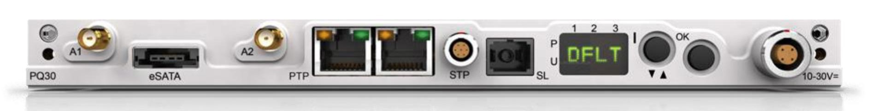{width=1940px height=244px}

Порядок восстановления параметров загрузки системы по умолчанию:

·          Прокрутите пункты меню с помощью кнопки **I** до появления надписи **DFLT**;

·          Нажмите кнопку **OK**, чтобы выбрать этот пункт меню. На дисплее появится надпись **SURE (подтвердить)**;

·          Снова нажмите кнопку **OK**, чтобы подтвердить команду;

·          На дисплее появится надпись **OK**.

Параметры загрузки системной платы ORION-Rx по умолчанию:

| **Вход Ethernet (e)** | : 192.168.100.5 |
|-----------------------|-----------------|
| **IP-адрес WLAN**     | :192.168.2.204  |
| **Режим DHCP**        | : отключен      |
| **Режим моста**       | : отключен      |
| **Пароль ftp (pw)**   | : password      |

### **Сообщения, отображаемые в пользовательском интерфейсе при загрузке**

При включении прибора ORION-Rx начнется загрузка прошивки, хранящейся во внутренней флэш-памяти. Правильная загрузка выполняется в три этапа:

·          Загрузка системной платы и начало обмена данными по внутренней шине VMEbus и по внешней сети LAN или Wi-Fi;

·          Загрузка каждой платы нормирования сигнала в системе;

·          Загрузка каждого модуля в системе.

Во время загрузки на пользовательском интерфейсе прибора отображаются следующие сообщения:

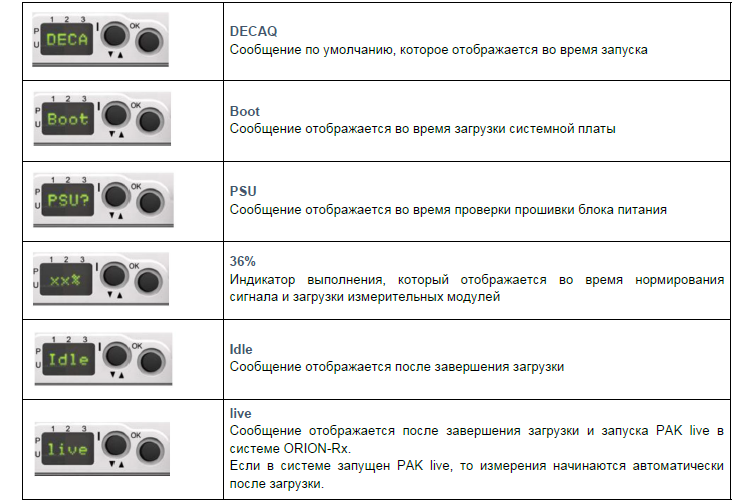{width=756px height=502px}

### Индикаторы пользовательского интерфейса. Обновление прошивки блока питания.

Прошивку блока питания можно обновлять. При необходимости обновления оно автоматически начнется во время загрузки ORION-Rx, при этом обычная процедура загрузки будет прервана.

Во время обновления прошивки блока питания на дисплее пользовательского интерфейса будет отображаться следующая информация:

·          На дисплее пользовательского интерфейса на несколько секунд появится надпись **Load (загрузка)**, которая обозначает, что выполняется обновление прошивки блока питания;

·          После этого на дисплее будут вращаться символы **/ / / /**;

·          Начнет мигать **светодиод 1**;

·          После успешного завершения обновления (в течение минуты) на дисплее появится сообщение **RST?**;

·          Нажмите кнопку **OK**, чтобы подтвердить **RST?**;

·          Снова нажмите кнопку **OK**, чтобы подтвердить команду.

Если надпись **RST?** не появится через несколько минут, выключите и включите прибор ORION-Rx и повторите процедуру обновления прошивки блока питания.

Обновление прошивки блока питания выполняется, как правило, после установки новой прошивки прибора ORION-Rx.

### **Индикаторы пользовательского интерфейса. Другие сообщения об обновлении прошивки.**

После успешной загрузки системы ORION-Rx можно при необходимости обновить прошивку прибора с помощью программного обеспечения PAK по сетевому соединению Ethernet. Прошивка ORION-Rx включает три раздела, каждый из которых соответствует целевому устройству, т.е. контроллеру (системной плате), плате нормирования сигнала и MiniTerminal.

На дисплее отображается информация о том, какой раздел обновляется в данный момент:

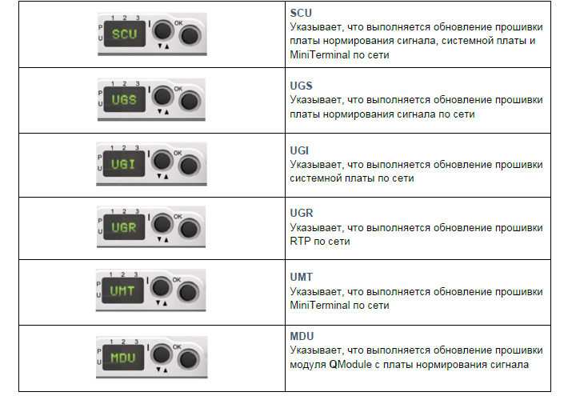{width=725px height=495px}

### **Информация о светодиодах прибора  ORION-Rx**

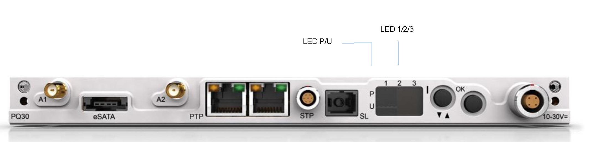{width=2156px height=514px}

С помощью пользовательского интерфейса ORION-Rx можно получать информацию о конкретной системе и выполнять определенные значимые команды. Интерфейс расположен на системной плате прибора и включает дисплей на четыре символа, пять светодиодов (светодиоды 1,2,3 и светодиоды P и U) и две кнопки (кнопка **I** и кнопка **OK**).

Светодиоды пользовательского интерфейса показывают, когда система активна, а также предоставляют информацию о различных состояниях аккумуляторной батареи и источника питания прибора ORION-Rx.

Ниже приведено краткое описание состояний каждого светодиода и их значения:

**Горит светодиод 1**

Система работает от аккумуляторной батареи ORION-Rx.

**Светодиод 1 мигает каждые 5 секунд**

Система активна.

**Мигает светодиод 2**

Низкий заряд аккумуляторной батареи. На дисплее пользовательского интерфейса также будет отображаться надпись **LOW (низкий заряд)**. Когда емкость аккумулятора будет исчерпана, система выключится, и ценные данные могут быть потеряны. Соответственно, важно как можно скорее закончить все испытания или подключиться к внешнему источнику питания.

**Мигает светодиод 3**

Ошибка аккумуляторной батареи. Возможные причины:

-  Температура аккумулятора находится вне допустимого диапазона зарядки;

-  Неисправен датчик температуры аккумулятора;

-  Максимальное напряжение элемента превышает 1,8 В;

-  Недостаточное входное напряжение зарядного устройства системной платы ORION-Rx. Может быть обусловлено неисправностью системной платы ORION-Rx или нестабильным внешним входным напряжением прибора;

-  Отсутствует аккумулятор.

**Последовательно мигают светодиоды 3, 2, 1**

Идет зарядка аккумуляторной батареи. Из-за свойств никель-кадмиевых и никель-металлогидридных аккумуляторных батарей заряжать их можно только при температуре от 10 до 45 °C.

**Светодиоды 3 и 2 мигают одновременно**

Режим ожидания зарядки аккумулятора во время цикла динамической зарядки

**Горит светодиод P**

Неправильная полярность на входе питания прибора  ORION-Rx

**Горит светодиод U**

Входное напряжение питания выше или ниже допустимого диапазона