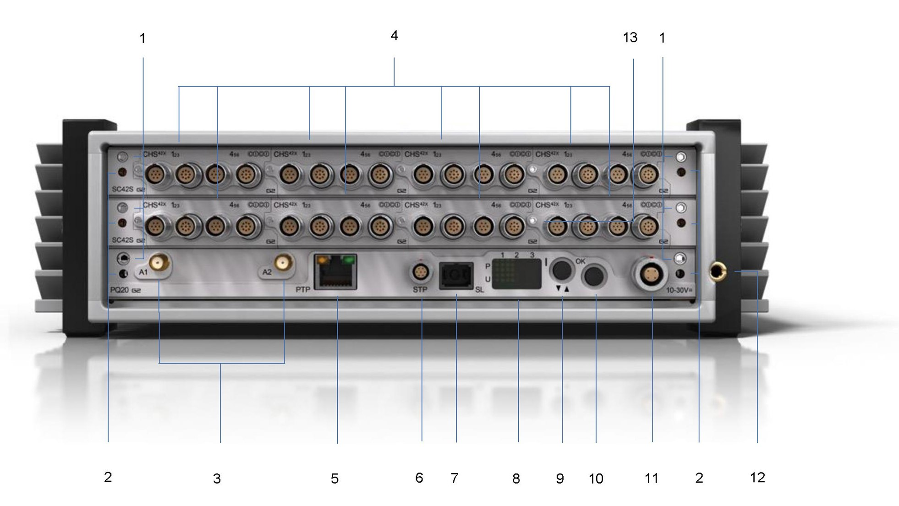
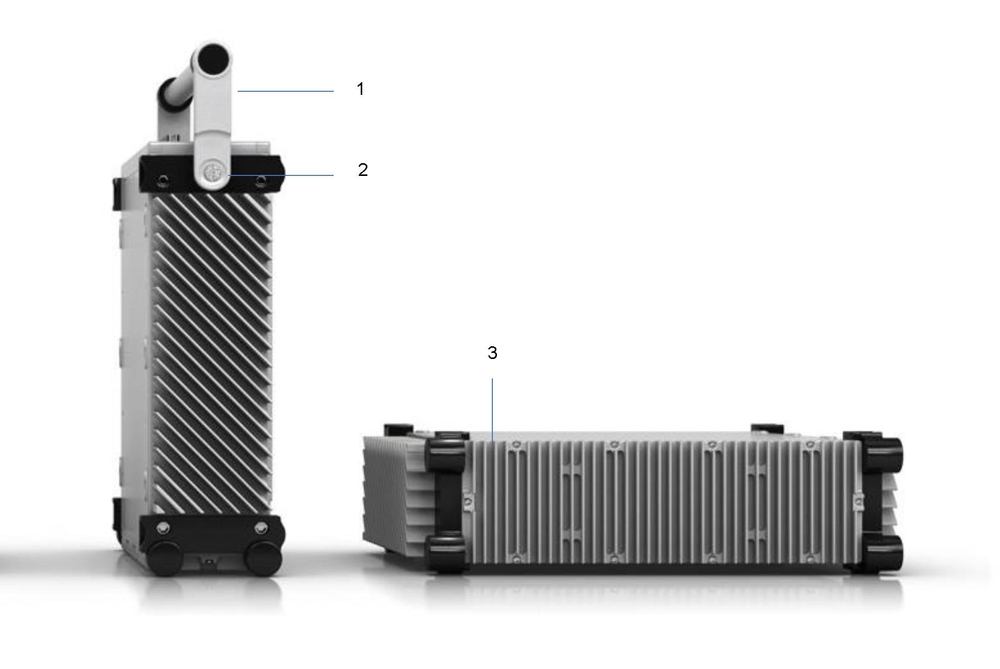

### Вид спереди

{width=1962px height=1105px}

1\.      Нажимной извлекающий винт

Открутите нажимной извлекающий винт для извлечения платы контроллера из корпуса.

2\.      Портал для устройств теплового расширения

Перед проведением измерений убедитесь, что устройства теплового расширения надежно закреплены. <color color="red">*Дополнительная информация приведена в разделе*</color> <color color="red">[*«Рекомендации по обращению для обеспечения эффективного охлаждения»*](#bookmark11)*.*</color>

3\.      Встроенные Wi-Fi антенны, IEEE 802.11 b/g/n (опционально)

4\.      Измерительные модули

5\.      Ethernet (Ethernet / PTP), Ethernet 1000BASE-T, PTP (протокол точного времени),  IEEE 1588-2008 PTP через Ethernet.

6\.      S-Port для подключения дополнительных устройств

7\.      SyncLink

Синхронизация систем ORION с помощью SyncLink.

8\.      Дисплей пользовательского интерфейса

Получение информации о системе и выполнение команд с помощью пользовательского интерфейса. <color color="red">*Дополнительная информация приведена в разделе*</color> <color color="red">[*«Навигация по пользовательскому интерфейсу DECAQ»*](#bookmark6)*.*</color>

9\.      Кнопка I в пользовательском интерфейсе

Используйте кнопку **I** для прокрутки пунктов меню пользовательского интерфейса. <color color="red">*Дополнительная информация приведена в разделе*</color> <color color="red">[*«Навигация по пользовательскому интерфейсу DECA**Q**»*](#bookmark6)*.*</color>

10\.    Кнопка OK в пользовательском интерфейсе

Используйте кнопку **OK** для подтверждения выбора пунктов меню пользовательского интерфейса. <color color="red">*Дополнительная информация приведена в разделе*</color> <color color="red">[*«Навигация по пользовательскому интерфейсу DECA**Q**»*](#bookmark6)*.*</color>

11\.    Разъем питания LEMO®

Питание прибора ORION-R2 осуществляется от внешнего источника с помощью разъема LEMO®.

12\.    Клемма заземления

Подсоедините клемму заземления к контуру заземления здания, если существует риск поражения электрическим током в среде проведения измерений. Клемму можно использовать в качестве опорного заземления для измерения аналоговых сигналов (необходимо применить подходящие настройки к соответствующим каналам измерительных модулей). В некоторых случаях может использоваться для снижения шума аналоговых сигналов.

13\.    Нажимной винт

Используйте нажимной винт для установки и извлечения модулей.

### Вид сбоку

{width=1960px height=1312px}

1\.      Рукоятка

Используйте рукоятку, чтобы облегчить переноску прибора.

2\.      Кнопка регулировки рукоятки

Нажмите на кнопку, чтобы отрегулировать рукоятку. Рукоятку можно переместить на 0–45°, 90°, 135° и 180°. После перевода рукоятки в одно из четырех положений она будет зафиксирована до повторного нажатия кнопки регулировки.

3\.      Ребра

Ребра обеспечивают кондуктивное охлаждение корпуса системы. Следите, чтобы во время проведения измерений ребра были открыты.