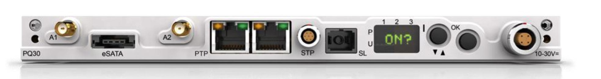
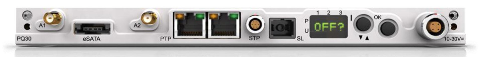

Перед включением прибора ORION-Rx проверьте, что его питание осуществляется от внешнего источника или в прибор установлена заряженная аккумуляторная батарея.

### **Включение**

{width=1968px height=261px}

Чтобы включить прибор ORION-Rx с помощью пользовательского интерфейса, выполните следующие действия:

·          Нажмите и удерживайте кнопку **I**. Замигают светодиоды, что будет означать инициализацию;

·          Когда на дисплее пользовательского интерфейса появится надпись **ON? (Включить?)**, нажмите кнопку **OK** (выберите **ON**);

·          На дисплее пользовательского интерфейса появится надпись **SURE (подтвердить)**. Нажмите кнопку **OK**, чтобы подтвердить **SURE**;

·          На дисплее пользовательского интерфейса появится надпись **DECAQ**, которая обозначает начало загрузки системы;

·          Если система работает от аккумуляторной батареи, на дисплее пользовательского интерфейса появится надпись **BKup (резервный источник питания)**.

·          После этого на дисплее отобразится надпись **Wait (ожидание)**, которая означает, что прибор ORION-Rx начал инициализацию плат нормирования сигнала и модулей. Далее вместо надписи **Wait** отобразится процент загрузки и обновления \[**xx%**\].

·          Дождитесь, пока на дисплее пользовательского интерфейса появится надпись **Idle (ждущий режим)**, которая означает, что прибор ORION-Rx успешно включен и загружен.

### **Выключение**

{width=1933px height=231px}

Чтобы выключить прибор ORION-Rx с помощью пользовательского интерфейса, выполните следующие действия:

·          Пролистайте пункты меню с помощью кнопки **I** до появления на дисплее надписи **OFF? (выключить?)**.

·          Выберите **OFF?** нажатием на кнопку **OK**. На дисплее появится надпись **SURE (подтвердить)**.

·          Подтвердите **SURE** нажатием на кнопку **OK**. На дисплее появится надпись **OK**. Нажмите **OK**.

### **Примечание**

Не выключайте прибор ORION-Rx во время испытаний. При выполнении описанного выше порядка действий система выключится независимо от того, проводится ли в данный момент испытание. Перед выключением системы убедитесь, что последовательность испытаний завершена, так как в противном случае можно потерять ценные данные.

