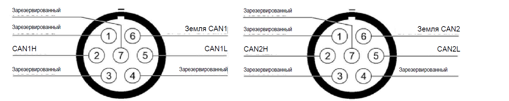

<image src="./vstroennye-kanaly-can-can-fd.png" crop="0,0,100,100" scale="76" width="464px" height="201px"/>

#### **Описание**

ORIONm обеспечивает интерфейс для подключения к двум шинам CAN и CAN FD (CAN с гибкой скоростью передачи данных). CAN FD -- это расширение первоначального протокола CAN, обеспечивающее увеличение пропускной способности. Получаемые сообщения CAN содержат метку времени для синхронизации приема с данными аналоговых и цифровых измерений, поступающих от других модулей в системе. Функции включают несколько режимов: участие, только прослушивание и петля. Для каждого из этих каналов обеспечивается независимая фильтрация получения сообщений CAN.

Эти каналы можно использовать:

•           при отслеживании CAN-сообщений,

•           при управлении CAN-устройствами.

#### **Функции**

•           Два канала CAN и CAN FD, поддерживающие режим CAN 2.0B или смешанный режим CAN2.0B и CAN FD.

•           Разъем LEMO® EHG.0B.307 (7-контактный) для каждого канала CAN (или CAN FD) (требуется подмодуль CANC10/FLXB20, доступные кабели: 300 мм и 3000 мм).

•           Каналы с собственным питанием электрически изолированы от остальной системы, но не друг от друга.

•           Соответствует стандарту ISO 11898-1:2015 (ISO CAN FD)

•           Поддержка скорости арбитража от 14,4 кбит/с до 1000 кбит/с.

•           Поддержка скорости передачи данных от 14,4 кбит/с до 8 мбит/с (один канал) или 2 мбит/с (два канала одновременно).

•           Поддержка конфигурации точки выборки для этапа арбитража.

•           Требуется внешняя оконечная нагрузка шины.

•           Три режима работы:

\-     Участие -- активное подтверждение сообщений, передаваемых по шине, и отправка сообщений.

\-     Только прослушивание -- пассивная интерпретация сообщений, передаваемых между другими узлами на шине.

\-     Петлевой -- формирование внутренней виртуальной шины, получающей сообщения, отправленные ей самой.

•           Каждое CAN-сообщение, полученное и принятое CAN-модулем, снабжается меткой времени для синхронизации полученных CAN-сообщений с остальными данными измерений.

•           Индивидуально настраиваемый список идентификаторов на канал для фильтрации приема для всех CAN-сообщений, полученных от CAN-шины.

•           Индивидуально настраиваемая передача CAN-сообщений.

•           Каждый канал оснащен защитой от ЭСР и других вредных импульсных помех.

#### **Информация о разъеме и назначении контактов**

{width=1408px height=282px}

*Интерфейсы CAN (CAN FD) (два разъема): назначение контактов 7-контактного разъема LEMO*® *EHG.0B (если смотреть на разъем на лицевой панели). Рекомендуется использовать ответный разъем FGG.0B.307.CYCD52Z.*

#### **Функциональная схема**

{width=911px height=529px}