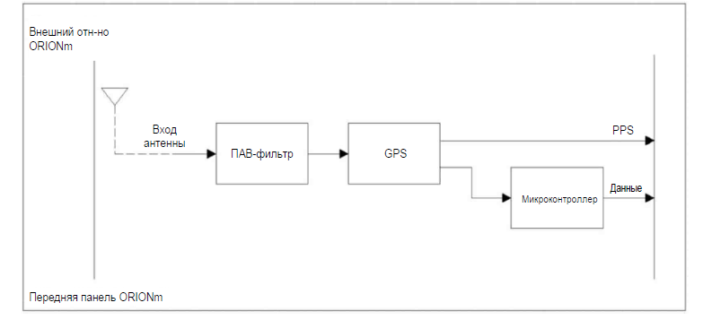

<image src="./vstroennyy-gps-kanal.png" crop="0,0,100,100" scale="98" width="702px" height="278px"/>

#### **Описание**

Встроенный GPS-канал представляет собой профессиональный ГНСС-приемник и чувствительную активную антенну, встроенные в верхний корпус антенны ORIONm. Он может использоваться для ведения журналов местонахождения измерений, синхронизации по времени суток и местонахождению или активации измерений скорости.

#### **Функции**

•           56-каналов приема сигнала GPS L1C/A, QZSS L1C/A (опция: GALILEO и ГЛОНАСС).

•           Частота обновления данных о местонахождении и времени до 10 Гц

Точность GPS-модуля зависит от многих факторов Стандартные характеристики GPS-модуля:

•           Точность позиционирования: 2,5 м

•           погрешность сигнала импульса времени: \< 100 нс,

•           погрешность по скорости: 0,1 мс,

•           время до первого определения местоположения: от 5 с до 30 с (холодный запуск)

#### **Функциональная схема**

{width=793px height=357px}

