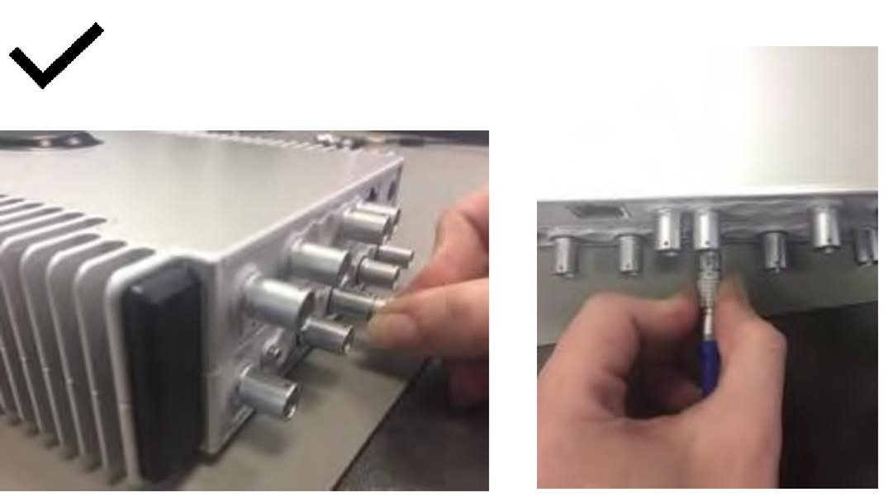
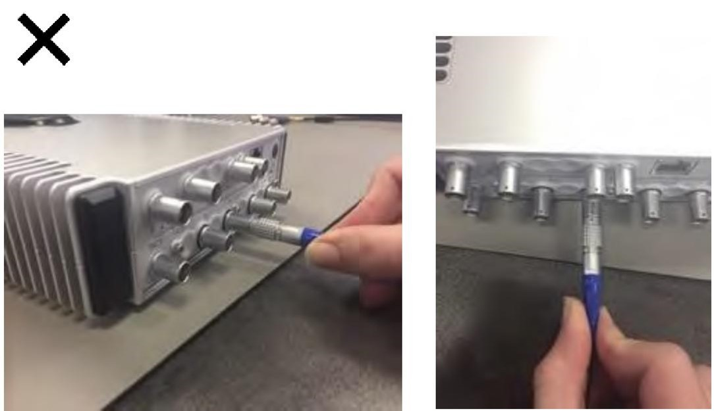

### Установка модуля

•           Перед установкой модуля убедитесь, что система  выключена (все индикаторы должны потухнуть). Простого отключения внешнего источника питания недостаточно. Установка модуля при работающем приборе ORION может привести к повреждению модуля и системы.

•           Соблюдайте крайнюю осторожность при первой установке модуля в разъем на передней панели ORION. Держите модули только за передние панели или края платы. Храните модули только в антистатических пакетах. Не прикасайтесь к разъемам модулей.

•           Наденьте антистатический браслет, подсоединенный к заземленной антистатической подложке.

•           Извлеките модуль из антистатического пакета.

•           Аккуратно расправьте ленту, экранирующую электромагнитные помехи (делайте это чистыми пальцами).

•           Вставьте модуль в пустой разъем: нажимной винт слева должен войти в резьбу. Если потребуется дополнительно расправить ленту, воспользуйтесь отверткой.

•           Затяните винт с помощью шестигранного ключа 2,0 мм. По мере затягивания винта модуль будет задвигаться в разъем.

•           При следующем включении система ORION автоматически обнаружит новый установленный модуль.

### Извлечение модуля

•           Перед извлечением модуля убедитесь, что система ORION выключена (все индикаторы должны потухнуть). Простого отключения внешнего источника питания недостаточно. Извлечение модуля при работающем приборе ORION может привести к повреждению модуля и системы.

•           Наденьте антистатический браслет, подсоединенный к заземленной антистатической подложке.

•           Отсоедините все датчики и кабели, подключенные к модулю (см. раздел ниже).

•           Перед извлечением модуля его необходимо охладить до температуры ниже 40 °C. Это важно, поскольку стопорное кольцо между нажимным винтом и гайкой при высоких температурах может повредиться.

•           Подготовьте антистатический пакет для извлекаемого модуля.

•           Ослабьте винт с помощью шестигранного торцевого ключа 2,0 мм. По мере ослабления винта модуль будет автоматически выдвигаться из разъема.

•           Полностью ослабив прижимной винт, придерживая модуль за переднюю панель, извлеките его из разъема и немедленно поместите в антистатический пакет.

•           Все пустые разъемы модулей ORION необходимо закрывать панелями-заглушками (MBL). В противном случае попадание пыли или других предметов может повредить ORION.

### Обращение с разъемами LEMO®

Интерфейсы ORION S-Port, CAN и TAC, а также некоторые другие модули оснащены разъемами LEMO®.

При использовании разъемов LEMO® обязательно пользуйтесь фиксирующей муфтой, вставляя разъем в гнездо и извлекая его из гнезда. Не пытайтесь подсоединить или отсоединить разъемы LEMO®, потянув за кабель. Это приведет к повреждению кабеля.

На рисунках ниже показано, как правильно вставлять и извлекать разъем LEMO®, используя фиксирующую муфту:

{width=1081px height=603px}

Ниже показано, как нельзя вставлять и извлекать разъем LEMO® (удерживая его за кабель). Ни в коем случае так *не делайте*:

{width=1084px height=625px}

### **Рекомендуемые ответные разъемы**

| **Наименование** | **Артикул**                                    | **Рекомендуемый ответный разъем**                     |
|------------------|------------------------------------------------|-------------------------------------------------------|
| **CAN42**        | LEMO® EHG.0B.307.CLN                           | 7-контактный LEMO® FGG.0B.307 с прямым штекером       |
| **AL042S**       | LEMO® EGG.0B.307.CLN                           | 7-контактный LEMO® FGG.0B.307 с прямым штекером       |
| **CHG42S**       | MICRODOT JACK                                  | Зажимной штекер Microdot                              |
| **CHS42X**       | LEMO® EHG.0B.309 CLN с укороченной гильзой 0,9 | 9-контактный LEMO® FGG.0B.309 с прямым штекером       |
| **DCH42S**       | TWIN BNC RECEPTACLE                            | Amphenol Twin-BNC 31-224 или 31-2226, зажимной штекер |
| **ICS42**        | LEMO® EHG.0B.309 CLN с укороченной гильзой 0,9 | 9-контактный LEMO® FGG.0B.309 с прямым штекером       |
| **ICT42S (1)**   | LEMO® EHG.0B.303.CLN                           | 3-контактный LEMO® FGG.0B.303 с прямым штекером       |
| **ICT42S (2)**   | LEMO® EHG.0B.304.CLN                           | 4-контактный LEMO® FGG.0B.304 с прямым штекером       |
| **MIC42X**       | LEMO® EGG.1B.307.CLN                           | 7-контактный LEMO® FGG.1B.307 с прямым штекером       |
| **THM42**        | LEMO® EHG.0B.307.CLN                           | 7-контактный LEMO® FGG.0B.307 с прямым штекером       |
| **WSB42X**       | LEMO® EGG.1B.307.CLN                           | 7-контактный LEMO® FGG.1B.307 с прямым штекером       |